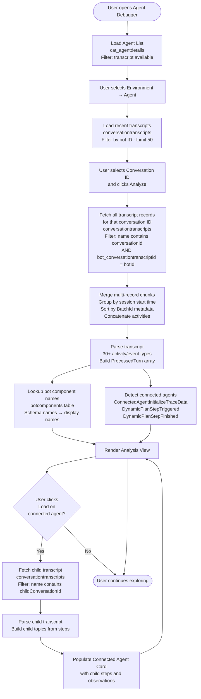

# Agent Debugger

The **Agent Debugger** is a diagnostic tool that lets users load any recorded conversation and inspect every decision the agent made — step by step, with timing, token usage, knowledge sources, arguments, and observations.

---

## Table of Contents

1. [Overview](#overview)
2. [Prerequisites](#prerequisites)
3. [Getting Started — Filters](#getting-started--filters)
4. [Analysis View](#analysis-view)
   - [General Information](#general-information)
   - [Conversation Preview](#conversation-preview)
   - [Debug Information](#debug-information)
   - [Transcript JSON](#transcript-json)
5. [Connected and Child Agents](#connected-and-child-agents)
6. [How Data Is Fetched and Processed](#how-data-is-fetched-and-processed)
7. [Troubleshooting](#troubleshooting)

---

## Overview

When a conversation takes place in Copilot Studio, the platform records a detailed activity log — every message, every plan step triggered, every knowledge source searched, every action invoked — as a **Conversation Transcript** in Dataverse. The Agent Debugger reads that transcript and surfaces it in a structured, human-readable interface.

**What it shows:**

| Area | What you learn |
|---|---|
| Conversation Preview | Full chat exchange, rendered with markdown and adaptive cards |
| Debug Information | Step-by-step execution for the selected user message: every topic, action, knowledge search, and tool invoked — with thought, arguments, observation, token counts, and knowledge sources |
| Transcript JSON | Full raw transcript activities as syntax-highlighted, searchable JSON — opened via the **View JSON** link in the Conversation Preview header |
| General Information | Session count, turn count, outcome, duration, start time, channel, and AI model used |

**Key capabilities:**

- Debug **multi-agent conversations**: automatically detects connected and child agents, and lets you drill into their transcripts with a single click
- Inspect **step arguments and observations**: see exactly what inputs were passed to every action, tool, or knowledge source — and what it returned
- Review **token consumption**: prompt and completion token counts per step and per turn
- Correlate **knowledge sources**: see what was searched, what was returned, and what was actually cited in the answer
- Copy conversation IDs, step IDs, or any JSON for use in support tickets or bug reports

---

## Prerequisites

### 1. Agent Inventory

See the Agent Inventory documentation for setup instructions:
**→ [AGENT\_INVENTORY.md](https://github.com/microsoft/Power-CAT-Copilot-Studio-Kit/blob/main/AGENT_INVENTORY.md)**

### 2. Conversation Transcripts

Conversation transcripts are supported in **production** and **sandbox** Dataverse environments. See [View and export conversation transcripts](https://learn.microsoft.com/en-us/microsoft-copilot-studio/analytics-sessions-transcripts) for details.

> **Note:** Transcripts may take a few minutes to appear after a conversation ends.

### 3. Security role and connection permissions

The user must have the **CSK - Administrator** security role within the kit for this feature to be accessible.

The **Dataverse connection reference** used by the app must have **Read** access to the following tables in the target environment:

| Table | Logical Name |
|---|---|
| **Conversation Transcripts** | `conversationtranscripts` |
| **Bots** | `bot` |
| **Bot Components** | `botcomponents` |

> **Cross-environment access:** If the agent being debugged is in a different environment from where the kit is installed, the Dataverse connection must be authenticated in that remote environment with the same read permissions.

---

## Getting Started — Filters

When you open Agent Debugger, you see a three-step cascading filter bar before any data is loaded.

```
┌──────────────────┐   ┌──────────────────┐   ┌──────────────────────┐
│  Environment     │ → │  Agent           │ → │  Conversation ID     │
│  (dropdown)      │   │  (dropdown)      │   │  (search + dropdown) │
└──────────────────┘   └──────────────────┘   └──────────────────────┘
                                                           │
                                                   [ Analyze ]
```

### Filter 1 — Environment

Populated from the distinct environment names found in Agent Inventory. Selecting an environment narrows the Agent dropdown to only agents registered in that environment.

### Filter 2 — Agent

Shows all agents in the selected environment that have at least one conversation transcript (`cat_istranscriptavailablecode = 1`). Selecting an agent loads the most recent 50 conversations for the Conversation ID dropdown.

### Filter 3 — Conversation ID

- **Default:** Shows the 50 most recent unique conversations for the selected agent.
- **Typing in the box:** Triggers a full search across all transcripts for that agent (up to 100,000 records), allowing you to find older or specific conversations.

Once a Conversation ID is selected, the **Analyze** button becomes active. Click it to open the full analysis view.

---

## Analysis View

The analysis view is a two-column layout: the **Conversation Preview** (left, sticky) and the **Debug Information panel** (right). Above both columns is a General Information summary. The Conversation Preview header includes a **View JSON** link to open the full raw Transcript JSON.

```
┌──────────────────────────────────────────────────────────────┐
│  General Information                                          │
│  Sessions: 1   Turns: 7   Outcome: Escalated   Duration: 3m  │
├─────────────────────────┬────────────────────────────────────┤
│  Conversation Preview   │  Debug Information (right)         │
│  (left, sticky)         │                                    │
│                         │  Turn 1 — "Book a flight"          │
│  User: Book a flight    │   ├─ Booking Topic  0.4s           │
│  Bot:  Where would...   │   ├─ Lookup Flights 2.1s           │
│  ...                    │   └─ Adaptive Card  0.1s           │
│                         │                                    │
│  [View JSON]            │  Turn 2 — "London"                 │
│                         │   └─ ...                           │
└─────────────────────────┴────────────────────────────────────┘
```

### General Information

Displayed as summary cards at the top of the analysis view.

| Field | Description |
|---|---|
| **Sessions** | Number of conversation sessions (multiple sessions occur when a user returns to the same conversation after inactivity) |
| **Turns** | Number of user messages in the conversation |
| **Outcome** | Session outcome reported by the platform (e.g., Resolved, Escalated, Abandoned, SystemError) |
| **Duration** | Total conversation duration from first to last activity |
| **Start Time** | When the conversation began (local time) |
| **Channel** | Communication channel used (e.g., webchat, msteams) — shown when available |
| **Model** | AI model name used by the agent — shown when available |

The outcome badge uses the platform's `SessionInfo` trace at the end of the transcript. A `SystemError` outcome usually means a flow, connector, or orchestration error occurred — check the Debug Information panel for red (failed) steps.

---

### Debug Information

The Debug Information panel (right side) shows every step the agent's orchestrator executed for the selected user message, grouped by conversation turn. Click any user message in the Conversation Preview to load its steps here.

**Each step card shows:**
- **Icon + Name** — derived from the step's schema name or component metadata (e.g., `Booking Topic`, `Search Knowledge`, `ResumeUpload`)
- **Type badge** — Topic, Knowledge, Code, Connector Action, Tool, Flow, Custom Prompt, Deep Reasoning, Connected Agent, or Child Agent
- **Duration** — how long the step took (from `DynamicPlanStepFinished.executionTime`)
- **Outcome badge** — success (completed) or failed

**Clicking a step expands it to show:**
- **Thought** — the LLM's reasoning before invoking this step (e.g., *"The user wants to process two resumes. I'll send both to the Application-Intake-Agent simultaneously."*)
- **Arguments** — the inputs passed to the step (JSON)
- **Observation** — the result returned by the step (JSON)
- **Token usage** — prompt + completion token counts and model name (when available)
- **Knowledge sources** — what was searched, what was returned, what was cited

**Clicking a user message in the Conversation Preview** loads that turn's steps into the Debug Information panel, making it easy to correlate what the user said with what the agent did.

**Step type icons and colours:**

| Type | Colour | Examples |
|---|---|---|
| Topic | Blue | CustomTopic steps |
| Knowledge | Teal | KnowledgeSource steps |
| Code | Green | P:CodeTool steps |
| Connected Agent | Purple | InvokeConnectedAgentTaskAction |
| Child Agent | Purple | type="Agent" orchestration steps |
| Connector Action | Grey | Office365Outlook, Teams, SharePoint |
| Flow | Purple | InvokeFlowTaskAction |
| Tool / MCP | Purple | MCP servers, P:UniversalSearchTool |
| Custom Prompt | Blue | Prompt steps with prediction output |
| Deep Reasoning | Blue | P:ReasonerTool |
| Failed | Red | Any step with error outcome |

---

### Conversation Preview

The Conversation Preview panel shows the full conversation exchange as it appeared to the user.

**What is rendered:**
- **Bot and user messages** — formatted with full markdown support: headings, lists, tables, bold/italic, code blocks, blockquotes, links
- **Adaptive Cards** — rendered in read-only mode exactly as the user would have seen them (TextBlocks, ColumnSets, Images, Input fields, Action buttons)
- **OAuth / consent cards** — shown with the connection name and Allow/Cancel buttons (display only)
- **Suggested actions** — displayed as chips below the bot message
- **Feedback** — thumbs up/down and comment captured by the platform, shown below the bot's message
- **Knowledge references** — expandable list of sources the bot cited

**Interaction:**
- **Clicking a user message** selects it and loads that turn's execution steps into the Debug Information panel on the right, so you can immediately see what the agent did in response to that message.
- The **View JSON** link in the Conversation Preview card header opens the full Transcript JSON dialog.

> **Note:** Bot messages in Copilot Studio use markdown formatting. All markdown in the Conversation Preview is rendered — tables, headings, bullet lists, and inline styles are displayed as formatted content, not raw syntax.

---

### Transcript JSON

The **View JSON** link in the top-right corner of the Conversation Preview header opens a **Transcript JSON** dialog showing the full raw transcript activities.

Use this when:
- You need to inspect an event type not surfaced in the Debug Information panel
- You want to copy specific fields for a support ticket
- You are investigating unexpected behaviour in the parsed views

**Features:**
- Full syntax highlighting
- Search with keyword highlighting and next/prev navigation
- Copy-to-clipboard button for the full JSON

---

## Connected and Child Agents

Copilot Studio supports **multi-agent architectures** where a parent agent delegates tasks to other agents:

- **Connected agents** — separately published agents invoked via `InvokeConnectedAgentTaskAction`
- **Child agents** — agents called through the orchestration layer (`type = "Agent"` steps)

The Agent Debugger detects both kinds automatically from the parent transcript and surfaces them as special step cards in the Debug Information panel.

**Connected Agent card shows:**
- Agent name
- Total execution time
- The instruction/task passed to the child agent
- The child conversation ID (copyable)

**Loading the child transcript:**

Click the **Load** button on a Connected Agent card to fetch and parse the child agent's own transcript from Dataverse. Once loaded, the card expands to show:

- Each step the child agent executed (topics, actions, tools)
- Step-level execution times, arguments, and observations
- The child's own knowledge searches and responses

> This works because each connected agent session writes its transcript to Dataverse under a conversation ID derived from the parent conversation: `{parentConversationId}_{sessionId}`. The Agent Debugger constructs this ID automatically and queries for it.

---

## How Data Is Fetched and Processed

All data originates from a single source: **Dataverse conversation transcripts**. No live agent connection is made.



### Transcript chunking and merging

Dataverse limits each record in `conversationtranscripts` to approximately 1 MB. Long or complex conversations are split across multiple records. The Agent Debugger:

1. Fetches all records whose `name` field contains the conversation ID
2. Groups records by session start time (to separate multiple sessions in the same conversation)
3. Within each session, sorts records by `metadata.BatchId` to restore chronological order
4. Concatenates all activity arrays into a single unified transcript

### Activity parsing

The merged transcript is then parsed event-by-event. The parser maintains a rolling buffer of debug state (pending steps, knowledge sources, token data) and flushes it onto each assistant message turn as it is encountered. The following trace event types are processed:

| Event | What is extracted |
|---|---|
| `message` | User/bot turns, adaptive card attachments, suggested actions |
| `DynamicPlanReceived` | Plan steps, parent–child plan nesting |
| `DynamicPlanStepTriggered` | Step start, LLM thought, step type |
| `DynamicPlanStepBindUpdate` | Step arguments (inputs) |
| `DynamicPlanStepFinished` | Step result (observation), execution time, state |
| `IntentRecognition` | Matched intent / topic name |
| `GenerativeAnswersSupportData` | Token counts, model name |
| `UniversalSearchToolTraceData` | Knowledge sources searched and returned |
| `KnowledgeTraceData` | Knowledge sources cited in the answer |
| `CodeTraceData` | Code execution output |
| `ConnectedAgentInitializeTraceData` | Connected agent session start |
| `ConnectedAgentCompletedTraceData` | Connected agent session end |
| `DynamicServerInitialize` / `DynamicServerToolsList` | MCP server info and tools |
| `ErrorTraceData` | Error codes and messages |
| `SessionInfo` | Overall session outcome |

---

## Troubleshooting

### Agent does not appear in the Environment or Agent dropdown

**Cause:** The agent has not been synced to Agent Inventory, or its `cat_istranscriptavailablecode` flag is not set.

**Resolution:**
1. Run a manual Agent Inventory sync for the environment in question.
2. Verify the agent record exists in the `cat_agentdetails` table in Dataverse.
3. Check that the `cat_istranscriptavailablecode` column is set to `1` on that record. The sync sets this flag when at least one transcript exists.
4. See [AGENT\_INVENTORY.md](https://github.com/microsoft/Power-CAT-Copilot-Studio-Kit/blob/main/AGENT_INVENTORY.md) for full sync instructions.

---

### Conversation ID not found in the dropdown

**Cause:** The conversation may be older than the 50-conversation default limit shown in the dropdown, or the transcript has not been written to Dataverse yet.

**Resolution:**
1. Type the conversation ID directly into the Conversation ID field — this triggers a full search across all transcripts for that agent (up to 100,000 records).
2. If the conversation just ended, wait 1–5 minutes for the transcript to be written to Dataverse, then refresh.
3. Verify the bot ID on the `cat_agentdetails` record matches the agent that ran the conversation.

---

### "Analyze" loads but shows no steps in the Debug Information panel

**Cause:** The transcript exists but contains only message-type activities with no diagnostic trace events. This typically happens when the conversation came from a channel that does not emit trace data (e.g., certain custom channels or very old schema versions).

**Resolution:**
1. Click the **View JSON** link in the Conversation Preview header to confirm activities are present.
2. Look for `type: "trace"` or `type: "event"` entries. If absent, trace logging may be disabled for this channel.
3. In Copilot Studio, verify that **Transcript logging** is enabled in the agent's **Settings → Advanced**.

---

### Connected Agent card shows "Load" but fetching fails

**Cause:** The Dataverse connection does not have read access to the child agent's transcript in the target environment, or the child transcript was written to a different environment.

**Resolution:**
1. Verify the connected agent's environment. The child conversation transcript is stored in the same Dataverse environment as the child bot.
2. If the child agent is in a different environment than the parent, the Dataverse connection must have read access to `conversationtranscripts` in that remote environment.
3. Check that the identity used by the connector has the **CSK - Administrator** role (or equivalent read rights on `conversationtranscripts`) in the child agent's environment.

---

### Steps show 0s duration in the Debug Information panel

**Cause:** Execution time is read from `DynamicPlanStepFinished.executionTime`. If the step finished events are missing or malformed, durations fall back to timestamp-based estimates.

**Resolution:**
1. Click the **View JSON** link in the Conversation Preview header and search for `DynamicPlanStepFinished`. Confirm the events are present and contain an `executionTime` field.
2. If events are missing, the conversation may have ended abruptly (e.g., `SystemError` outcome). Steps that never finished will show 0s.

---

### "Access denied" or blank page on load

**Cause:** The signed-in user does not have the **CSK - Administrator** or **System Administrator** role in the environment.

**Resolution:**
1. Ask an environment admin to assign the **CSK - Administrator** security role to the user in the target Dataverse environment.
2. If the app itself is in a different environment from the agent being debugged, roles must be granted in *both* environments.

---

### Transcripts appear incomplete (missing early messages)

**Cause:** Long conversations can span many 1 MB Dataverse records. If some records are missing or were purged, the merged transcript will have gaps.

**Resolution:**
1. Click the **View JSON** link in the Conversation Preview header and check the `mergedSessionKey` field on activities — gaps between batch IDs indicate missing chunks.
2. Dataverse transcript retention policies may have purged older records. Check the transcript retention setting in your environment's Copilot Studio configuration.
3. If retention is the issue, consider reducing conversation length or increasing the retention window.

---

### Steps show generic names (e.g., "unknown_12345") instead of readable topic names

**Cause:** The `botcomponents` table lookup failed or the component record was deleted.

**Resolution:**
1. Verify the user and connector have read access to the `botcomponents` table in the target environment.
2. If the component was deleted from Copilot Studio, the schema name has no matching record and the debugger falls back to the raw ID. This is expected for deleted topics or actions.
