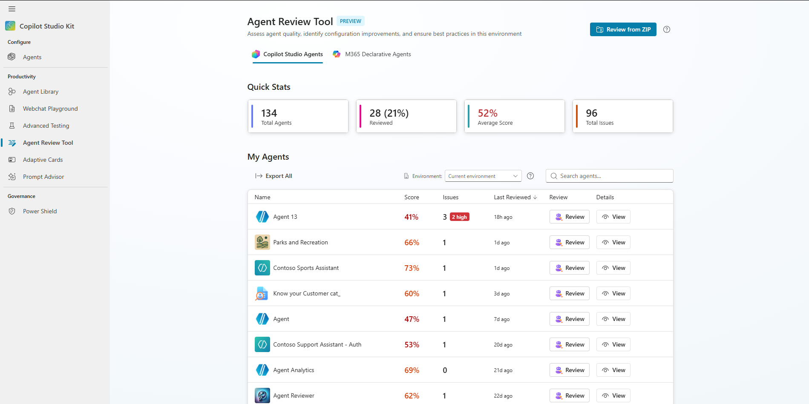
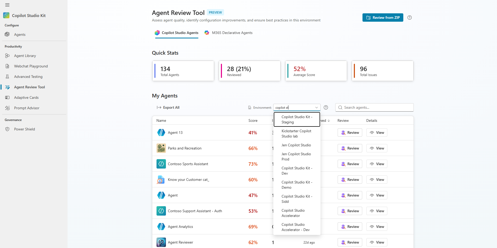
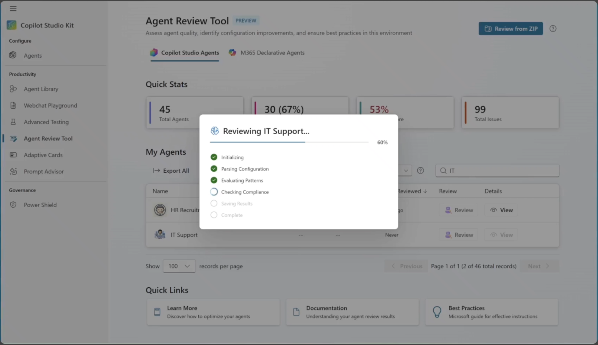
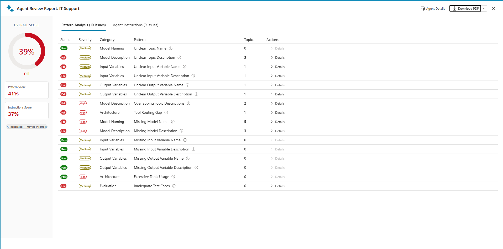
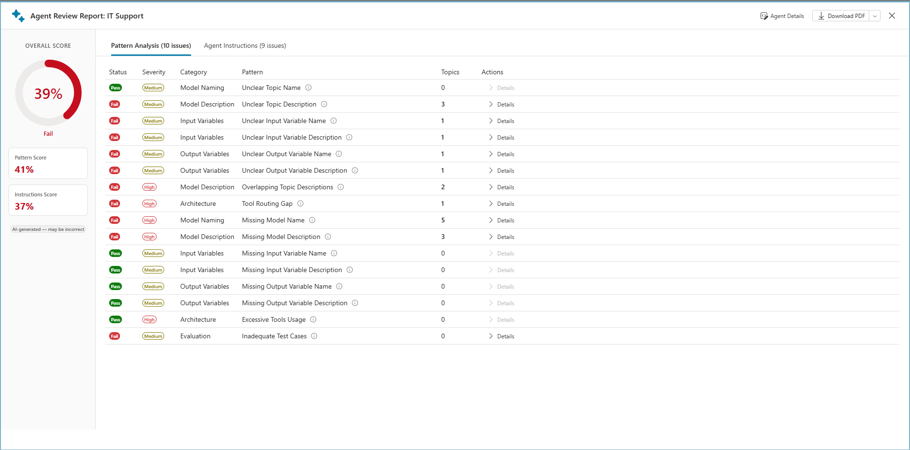
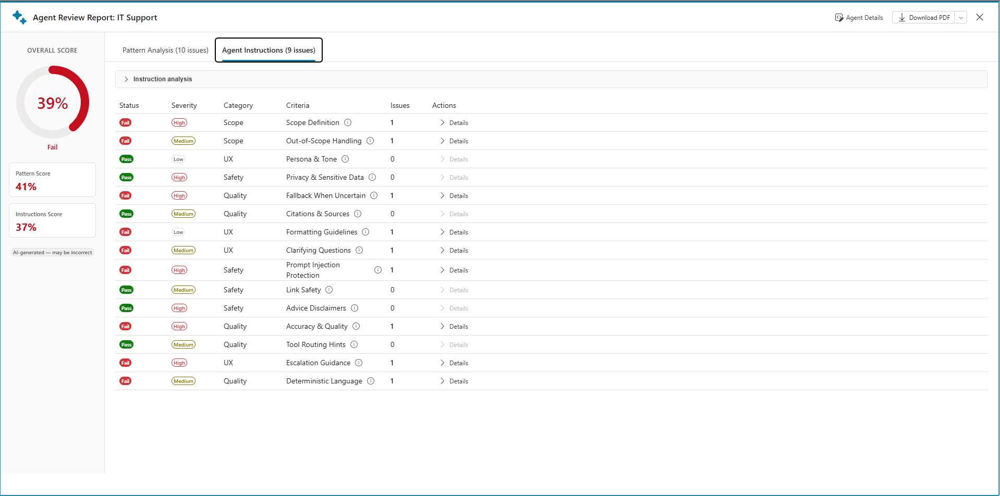
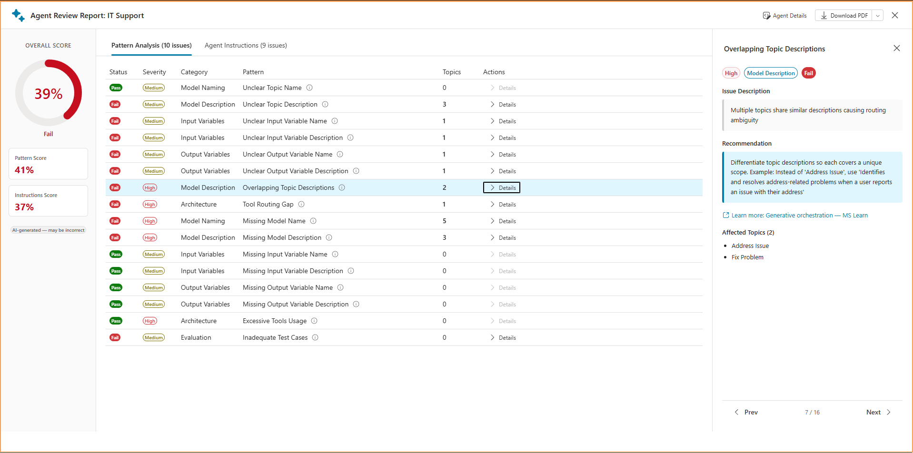
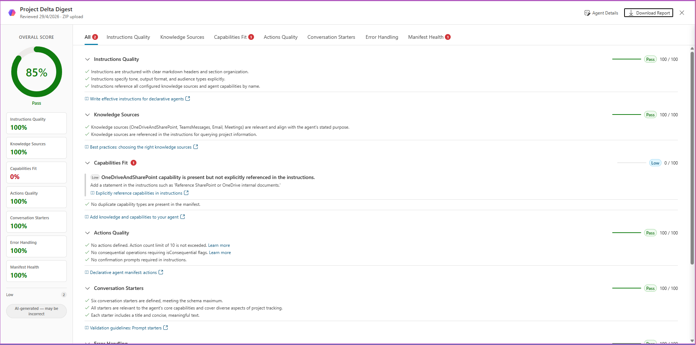

# Agent Review Tool 

---

## Table of Contents

1. [What Is the Agent Review Tool?](#1-what-is-the-agent-review-tool)
2. [Key Capabilities at a Glance](#2-key-capabilities-at-a-glance)
3. [Getting Started - The Dashboard](#3-getting-started---the-dashboard)
4. [Review Modes](#4-review-modes)
   - [Copilot Studio Agent Review](#copilot-studio-agent-review)
   - [Declarative Agent (M365 Copilot) Review](#declarative-agent-m365-copilot-review)
5. [What Happens During a Review](#5-what-happens-during-a-review)
6. [Patterns Detected](#6-patterns-detected)
   - [All 18 Patterns](#all-18-patterns)
   - [Pattern Categories](#pattern-categories)
   - [Severity Logic](#severity-logic)
7. [Compliance Criteria](#7-compliance-criteria)
   - [All 15 Criteria](#all-15-criteria)
   - [Category Breakdown](#category-breakdown)
8. [How Scores Are Calculated](#8-how-scores-are-calculated)
   - [Pattern Score](#pattern-score)
   - [Instruction Score](#instruction-score)
   - [Overall Score](#overall-score)
   - [Score Color and Label Guide](#score-color-and-label-guide)
9. [Reviewing Results](#9-reviewing-results)
   - [Overview Tab](#overview-tab)
   - [Patterns Tab](#patterns-tab)
   - [Compliance Tab](#compliance-tab)
   - [Pattern Detail Drill-Down](#pattern-detail-drill-down)
   - [Compliance Detail Drill-Down](#compliance-detail-drill-down)
10. [Exporting Results](#10-exporting-results)
    - [PDF Report](#pdf-report)
    - [SARIF Export](#sarif-export)
    - [Excel Export](#excel-export)
11. [Declarative Agent Review - Deep Dive](#11-declarative-agent-review---deep-dive)
12. [Security and Data Access](#12-security-and-data-access)
13. [First-Run Experience and Welcome Tour](#13-first-run-experience-and-welcome-tour)
14. [Frequently Asked Questions](#14-frequently-asked-questions)

---

## 1. What Is the Agent Review Tool?

The **Agent Review Tool** is an automated quality assessment and compliance review system for Microsoft Copilot Studio agents and Microsoft 365 Declarative Agents. It was built to help makers, admins, and governance teams identify issues, anti-patterns, and compliance gaps in their agents before those issues reach end users.

> **The core problem it solves:** As organizations scale their Copilot Studio deployments, manually reviewing each agent's configuration, instructions, and topic structure becomes impossible. The Agent Review Tool automates that review through an AI-powered analysis, surfacing actionable findings in under 60 seconds.

**Who it's for:**
- **Makers** - get actionable feedback to improve agent quality before deployment
- **Admins and CoE teams** - enforce governance standards across all agents in an environment
- **Security and Compliance officers** - verify agents follow privacy, safety, and accuracy guidelines

---

## 2. Key Capabilities at a Glance

| Capability | Details |
|---|---|
| **Agent coverage** | Copilot Studio agents + M365 Declarative Agents |
| **Review time** | Typically under 60 seconds per agent |
| **Patterns checked** | 18 patterns (10 deterministic + 8 AI-powered) |
| **Compliance criteria** | 15 instruction quality criteria |
| **Score system** | 0-100 overall score (50% patterns, 50% compliance) |
| **Export formats** | PDF, SARIF, Excel |
| **Data storage** | Microsoft Dataverse (user-scoped, RLS protected) |
| **AI engine** | Microsoft Copilot Studio AI Prompts via Dataverse PredictV2 |

---

## 3. Getting Started - The Dashboard

When you open the Agent Review Tool, you land on the **Dashboard**, the central hub showing all agents in your environment and their review status.

### Dashboard Layout



The dashboard shows everything at a glance: the tab bar switching between Copilot Studio and M365 agents, four stat cards summarizing the portfolio health, a search toolbar, the paginated agent grid, and the Upload ZIP button for offline reviews.

### Stat Cards Explained

The four stat cards at the top give you an instant health snapshot of your agent portfolio:

| Card | What It Shows | How It's Calculated |
|---|---|---|
| **Total Agents** | Count of all active bots in the environment | Query `bot` table where `statecode = 0` |
| **Reviewed** | Number and percentage of agents that have been reviewed | Count of completed reviews / total agents |
| **Average Score** | Mean overall score across all completed reviews | Sum of scores / reviewed count |
| **Total Issues** | Cumulative issues found across all reviewed agents | Sum of pattern failures + compliance failures |

### Agent Grid Columns

| Column | Content |
|---|---|
| **Name** | Agent display name with icon |
| **Score** | Overall review score (0-100) or `--` if not yet reviewed; color-coded |
| **Issues** | Summary of high / medium / low severity findings; `--` if not reviewed |
| **Last Reviewed** | Relative time ("2 hours ago", "1 week ago") or "Not reviewed" |
| **Actions** | "Review" for unreviewed agents; "View" for agents with existing reviews |

### Selecting an Environment

By default, the tool shows agents from the environment it is installed in. If you need to review an agent from a different environment, use the **environment selector** in the Dashboard toolbar to switch environments. The dropdown lists all Power Platform environments you have access to.

Once you select a different environment, the agent grid refreshes to show agents from that environment. You can then review any of those agents normally. The review result is stored in the current (home) environment, not the one you selected.



---

## 4. Review Modes

The tool supports two distinct review modes, accessible via the tab bar at the top of the dashboard.

### Copilot Studio Agent Review

This mode reviews agents built in Microsoft Copilot Studio. It reads directly from Dataverse - no file upload required.

**What it analyzes:**
- Topic configurations (names, descriptions, variables)
- Tool/action configurations (count, descriptions, routing)
- Knowledge source types
- Test case coverage
- Agent instructions (generative mode)
- Agent metadata (language, authentication, AI settings)

**How to start a review:**
1. Find your agent in the grid
2. Click **Review** - the analysis starts automatically
3. A progress dialog shows what's happening in real time
4. Results open in the Review Dialog when complete

**Re-reviewing an agent:**
Any agent can be re-reviewed at any time. Each review creates a new record in Dataverse. The grid always shows the most recent review result.

---

### Declarative Agent (M365 Copilot) Review

This mode reviews Microsoft 365 Declarative Agents, which are defined by a manifest JSON file and deployed to the Microsoft 365 Copilot ecosystem.

**Two ways to submit a DA for review:**

| Method | How | When to use |
|---|---|---|
| **Upload ZIP** | Click "Upload ZIP" in the page header; select exported package | Agent is from another tenant or not in catalog |
| **From M365 Catalog** | Connect to Microsoft 365 via the Graph API setup wizard; browse agents | Agent is deployed in your M365 tenant |

**What it analyzes (5 criteria, not 15):**

| Criterion | Weight | What's Checked |
|---|---|---|
| Instructions | 30% | Clarity, completeness, and quality of agent instructions |
| Knowledge | 20% | Grounding via connected knowledge sources |
| Capabilities | 15% | Use of CodeInterpreter and OneDriveAndSharePoint |
| Actions | 15% | Tool routing and action descriptions |
| Conversation Starters | 10% | Min 3, recommended 6 (max 12) |
| Graceful Error Handling | 10% | Error recovery and fallback behaviors |

> **Note:** The 15-criterion instruction compliance check is specific to Copilot Studio agents and does not apply to Declarative Agents.

---

## 5. What Happens During a Review

When you click **Review**, the tool runs an automated analysis that typically completes in under 60 seconds. A progress dialog keeps you informed while it works.



The analysis covers three things in sequence:

**1. Configuration analysis**
The tool reads the agent's complete configuration from Dataverse - every topic, tool, knowledge source, test case, and instruction. It checks for missing fields across all components and measures things like tool count and test coverage against Microsoft's documented best practices.

**2. AI-powered pattern evaluation**
An AI model reviews the same configuration to assess *quality*, not just completeness. It looks at whether topic names and descriptions are clear enough for the generative orchestrator to route correctly, whether multiple topics overlap in a way that would cause routing confusion, and whether tool descriptions give the AI enough guidance to invoke the right tool at the right time.

**3. Instruction compliance check**
A second AI model reads the agent's system instructions and checks them against 15 best-practice criteria from Microsoft's generative mode guidance - covering scope, safety, response quality, and user experience. For each criterion the instructions don't satisfy, it surfaces a specific finding and a concrete recommendation.

Once all three are complete, a PDF report is automatically generated and the results open in the Review Dialog.

> **Copilot Credits:** Each review consumes Copilot credits. The AI-powered steps (pattern evaluation, instruction compliance check, and PDF generation) each invoke an AI model via Dataverse. Plan accordingly if you are reviewing a large number of agents.

---

## 6. Patterns Detected

Patterns identify specific anti-patterns or missing best practices in an agent's configuration. The tool checks **18 patterns** across 7 categories.

### All 18 Patterns

| ID | Pattern Name | Category | Impact |
|---|---|---|---|
| `pat-001` | Missing Model Name | Model Naming | Generative orchestrator cannot reliably route to this topic |
| `pat-002` | Missing Model Description | Model Description | Topic may be skipped or wrongly triggered during routing |
| `pat-003` | Missing Input Variable Name | Input Variables | Users see unnamed variables, causing confusion in the conversation |
| `pat-004` | Missing Input Variable Description | Input Variables | AI cannot correctly extract the right value from user input |
| `pat-005` | Missing Output Variable Name | Output Variables | Output values are unlabelled and hard for users to interpret |
| `pat-006` | Missing Output Variable Description | Output Variables | AI lacks context to populate the variable correctly |
| `pat-007` | Excessive Tools Usage | Architecture | Too many tools degrade routing accuracy and increase latency |
| `pat-008` | Inadequate Test Cases | Evaluation | Regressions in topic behavior go undetected before deployment |
| `pat-009` | Missing Child Agent Description | Architecture | Orchestrator cannot decide when to delegate to the child agent |
| `pat-010` | Child Agent Architecture Sprawl | Architecture | Excessive delegation creates orchestration complexity and latency |
| `pat-011` | Unclear Model Name | Model Naming | Vague names cause the orchestrator to route to the wrong topic |
| `pat-012` | Unclear Model Description | Model Description | Poor descriptions lead to missed or incorrect topic triggers |
| `pat-013` | Unclear Input Variable Name | Input Variables | Ambiguous names make it harder for the AI to fill the variable correctly |
| `pat-014` | Unclear Input Variable Description | Input Variables | AI extracts the wrong value or asks unnecessary clarifying questions |
| `pat-015` | Unclear Output Variable Name | Output Variables | Downstream topics or flows that consume this variable may misinterpret it |
| `pat-016` | Unclear Output Variable Description | Output Variables | AI cannot reliably produce the expected output format or value |
| `pat-017` | Overlapping Topic Descriptions | Model Description | Multiple topics compete for the same user utterances, causing unpredictable routing |
| `pat-018` | Tool Routing Gap | Architecture | AI cannot decide which tool to call, leading to wrong tool invocations or no action |

For each failing pattern, the tool shows which topics are affected, the current value that triggered the finding, a suggested improvement, and a link to the relevant Microsoft Learn documentation.



---

### Pattern Categories

Patterns are grouped into 7 categories, sorted in this order in the results grid:

| # | Category | Patterns Included |
|---|---|---|
| 1 | Model Naming | pat-001, pat-011 |
| 2 | Model Description | pat-002, pat-012, pat-017 |
| 3 | Input Variables | pat-003, pat-004, pat-013, pat-014 |
| 4 | Output Variables | pat-005, pat-006, pat-015, pat-016 |
| 5 | Architecture | pat-007, pat-009, pat-010, pat-018 |
| 6 | Orchestration | (reserved for future AI-detected patterns) |
| 7 | Evaluation | pat-008 |

---

### Severity Logic

Pattern severity is determined by a combination of keyword matching and topic count:

| Condition | Severity Assigned |
|---|---|
| Pattern name contains "model name" or "model description" | **High** |
| Pattern name contains "variable" | **Medium** (unless topic count is 5 or more) |
| Topic count is 5 or more | **High** |
| Topic count is 2 or more | **Medium** |
| Topic count is 1 | **Low** |

> Severity drives both the visual badge in the results grid and the SARIF error level in the exported report.

---

## 7. Compliance Criteria

This part of the review evaluates the quality of an agent's **system instructions** - the natural language text a maker provides in the "Generative" settings of Copilot Studio. These instructions define how the agent behaves across all conversations.

The 15 criteria are derived from Microsoft's [generative mode guidance](https://learn.microsoft.com/en-us/microsoft-copilot-studio/guidance/generative-mode-guidance) and represent the most impactful best practices for instruction quality.

### All 15 Criteria

| # | ID | Criterion Name | Category | Severity | What It Checks |
|---|---|---|---|---|---|
| 1 | `scope-definition` | Scope Definition | Scope | **High** | Agent instructions explicitly define which topics the agent should and should not respond to |
| 2 | `out-of-scope-handling` | Out-of-Scope Handling | Scope | Medium | Instructions specify what to say when a user asks about something outside the agent's scope |
| 3 | `persona-and-tone` | Persona and Tone | UX | Low | Instructions define tone for non-default scenarios (professional/polite is already the default - skip if not needed) |
| 4 | `privacy-and-sensitive-data` | Privacy and Sensitive Data | Safety | **High** | Instructions contain explicit guidance on not storing, displaying, or repeating personal data |
| 5 | `fallback-when-uncertain` | Fallback When Uncertain | Quality | **High** | Instructions specify what to do when the agent doesn't have the information needed to answer |
| 6 | `citations-and-sources` | Citations and Sources | Quality | Medium | Instructions require the agent to cite document names and sections when referencing knowledge sources |
| 7 | `formatting-guidelines` | Formatting Guidelines | UX | Low | Instructions specify response format (bullets, tables, numbered steps) for structured output |
| 8 | `clarifying-questions` | Clarifying Questions | UX | Medium | Instructions address how to handle ambiguous queries by asking clarifying follow-up questions |
| 9 | `prompt-injection-resilience` | Prompt Injection Protection | Safety | **High** | Instructions include explicit safeguards against jailbreak attempts or prompt injection |
| 10 | `link-safety` | Link Safety | Safety | Medium | Instructions ensure only verified, safe links are shared with users |
| 11 | `advice-disclaimers` | Advice Disclaimers | Safety | **High** | Instructions include disclaimers for sensitive advice domains (finance, health, legal) |
| 12 | `accuracy-quality` | Accuracy and Quality | Quality | **High** | Instructions explicitly ground the agent in its knowledge sources and prohibit fabrication or guessing |
| 13 | `tool-routing-hints` | Tool Routing Hints | Quality | Medium | Instructions provide guidance on which tools or knowledge sources to use when routing is ambiguous |
| 14 | `escalation-guidance` | Escalation Guidance | UX | **High** | Instructions define what to do when the agent can't help: hand off to a human, suggest an alternative, or exit gracefully |
| 15 | `deterministic-language` | Deterministic Language | Quality | Medium | Instructions use absolute directives (always, never, only, must) rather than vague modifiers (might, usually, try, sometimes) |



---

### Category Breakdown

| Category | Criteria Count | Focus |
|---|---|---|
| **Scope** | 2 | Defines what the agent does and doesn't answer |
| **Safety** | 4 | Protects users from misinformation, data leakage, and manipulation |
| **Quality** | 5 | Ensures accurate, grounded, well-structured responses |
| **UX** | 4 | Shapes the conversational experience and escalation paths |

---

## 8. How Scores Are Calculated

All scores are on a 0-100 scale and are deterministic - the same inputs always produce the same score.

### Pattern Score

```
Pattern Score = (Passed Patterns / Total Patterns) x 100
```

- **Total patterns** = 10 deterministic + however many AI-detected patterns were returned (up to 8)
- **Passed patterns** = count where the pattern status is "pass"
- Result is rounded to the nearest integer

**Example:** 15 patterns total, 12 passing = Pattern Score of 80

---

### Instruction Score

The instruction score uses a **weighted point system** based on the inherent severity of each criterion:

| Inherent Severity | Points if Passed | Criteria Count | Max Points |
|---|---|---|---|
| High | 3 | 7 | 21 |
| Medium | 2 | 6 | 12 |
| Low | 1 | 2 | 2 |
| **Total** | | **15** | **35** |

```
Instruction Score = (Earned Points / 35) x 100
```

- For each of the 15 criteria: if no issue is found for that criterion, its inherent severity points are added
- If "missing instructions" is detected, all criteria fail and the score is 0
- Result is clamped to 100 and rounded to nearest integer

**Example:** 3 High and 2 Medium criteria fail:
- Points earned: (4 x 3) + (4 x 2) + (2 x 1) = 12 + 8 + 2 = **22 points**
- Score = (22 / 35) x 100 = **63**

---

### Overall Score

```
Overall Score = (Pattern Score x 0.5) + (Instruction Score x 0.5)
```

Both dimensions carry equal weight. If only one dimension is available (e.g., no instructions exist), that dimension's score is used directly.

---

### Score Color and Label Guide

| Score Range | Label | Color |
|---|---|---|
| 80 and above | Excellent | Green |
| 60 to 79 | Good | Amber |
| 40 to 59 | Fair | Red |
| Below 40 | Needs Improvement | Red |

---

## 9. Reviewing Results

After a review completes, results are displayed in the **Review Dialog**, a panel with three tabs.

---

### Overview Tab

The Overview tab gives you a high-level summary:

- **Overall score** - a circular gauge colored green, amber, or red
- **Pattern Score** and **Instruction Score** side by side
- **Agent metadata** - name, environment, language, authentication mode, AI settings
- **AI-generated summary** - a natural language description of the most significant findings
- **Review timestamp** and data source (live environment or ZIP upload)



---

### Patterns Tab

The Patterns tab shows the full grid of all 18 patterns evaluated, with columns:

| Column | Description |
|---|---|
| Status | Pass or Fail |
| Severity | High / Medium / Low badge |
| Category | Pattern category (Model Naming, Architecture, etc.) |
| Pattern Name | Full pattern name |
| Affected Topics | Count of topics affected by this pattern |
| Actions | "Details" button to open the Pattern Details dialog |

The grid is sortable by any column. Failing patterns appear first by default, sorted by severity (High, then Medium, then Low).

---

### Compliance Tab

The Compliance tab shows all 15 instruction criteria:

| Column | Description |
|---|---|
| Status | Pass or Fail |
| Severity | High / Medium / Low badge |
| Category | Scope / Safety / Quality / UX |
| Criterion Name | Full criterion name |
| Issues Found | Count of specific issues under this criterion |
| Actions | "Details" button to open the Compliance Details dialog |

---

### Pattern Detail Drill-Down

Clicking **Details** on any failing pattern opens the **Pattern Details dialog**, which shows:

- **Pattern name and description** - what this pattern checks
- **Why it matters** - the impact of this anti-pattern on agent quality
- **Affected topics table** - each topic with its current value and the AI's suggested replacement
- **Recommendation** - a concrete action to fix the issue
- **Learn More** - a direct link to the relevant Microsoft Learn documentation



---

### Compliance Detail Drill-Down

Clicking **Details** on any failing compliance criterion opens the **Compliance Details dialog**, which shows:

- **Criterion name, category, and severity**
- **What the criterion checks** - a plain-language explanation
- **Specific issue found** - the AI's analysis of what's missing or wrong
- **Recommendation** - exact language or patterns to add to the agent's instructions
- **Example** - where available, an example of a compliant instruction
- **Learn More** - link to the relevant Microsoft Learn guidance

---

## 10. Exporting Results

Three export formats are available from the Review Dialog header.

---

### PDF Report

A polished, human-readable PDF report suitable for sharing with stakeholders or attaching to a governance audit.

**Contents:**
- Executive summary with scores and key metrics
- Pattern evaluation results (status, severity, affected topics)
- Compliance findings (all 15 criteria)
- Recommendations for every issue found
- Agent metadata (name, environment, review date)

**File name:** `{AgentName}_review_{YYYY-MM-DD}.pdf`

The PDF is generated automatically at the end of every review and stored in Dataverse alongside the review record. Subsequent downloads retrieve the stored file without re-running the analysis.

---

### SARIF Export

SARIF (Static Analysis Results Interchange Format v2.1.0) is a JSON format designed for integration with developer tools and CI/CD pipelines.

**Use cases:**
- Upload to **GitHub Advanced Security** for SARIF-based PR annotations
- Import into **Azure DevOps** quality gate checks
- Process with third-party tools that consume SARIF (SonarQube, VS Code, etc.)

**Structure overview:**
```json
{
  "version": "2.1.0",
  "runs": [{
    "tool": {
      "driver": {
        "name": "Copilot Studio Agent Review Tool",
        "version": "1.0"
      }
    },
    "results": [
      {
        "ruleId": "pat-007",
        "level": "error",
        "message": { "text": "Excessive Tools Usage: 28 tools exceed the recommended limit of 25" },
        "properties": {
          "category": "Architecture",
          "recommendation": "Reduce tool count to 25 or fewer"
        }
      }
    ]
  }]
}
```

**Severity-to-SARIF level mapping:**
- High = `"error"`
- Medium = `"warning"`
- Low = `"note"`

**File name:** `{AgentName}_review.sarif`

---

### Excel Export

A multi-sheet Excel workbook for data analysis, reporting, and archival.

**Sheets:**

| Sheet | Contents |
|---|---|
| **Summary** | One row per reviewed agent - name, scores, issue counts, review date |
| **Patterns** | All 18 patterns - ID, name, category, severity, status, affected topics, recommendation |
| **Compliance** | All 15 criteria - ID, name, category, severity, status, issue count, recommendation |

**Formatting:** Headers are bold with brand-color backgrounds. Score and severity cells are color-coded (green/amber/red). Column widths are auto-adjusted.

**File name:** `{AgentName}_review_{YYYY-MM-DD}.xlsx`

---

## 11. Declarative Agent Review - Deep Dive

M365 Declarative Agents are a different kind of agent from Copilot Studio agents. They're defined entirely by a JSON manifest file and deployed to the Microsoft 365 ecosystem.

### What the DA Review Checks

The review first validates the manifest structure, checking that all required fields are present and the schema is well-formed. It then runs an AI evaluation against 5 quality criteria and generates a PDF report. The 15-criterion instruction compliance check (specific to Copilot Studio agents) does not apply here.

### The 5 DA Evaluation Criteria

| Criterion | Weight | What's Evaluated |
|---|---|---|
| Instructions | 30% | Clarity, specificity, and completeness of the agent's system prompt |
| Knowledge | 20% | Use of connected knowledge sources for grounding |
| Capabilities | 15% | Use of CodeInterpreter and OneDriveAndSharePoint capabilities |
| Actions | 15% | Presence and quality of tool action descriptions |
| Conversation Starters | 10% | Count and quality (minimum 3, recommended 6) |
| Graceful Error Handling | 10% | Handling of unknown inputs and error states |

### Manifest Health Check (Local Validation)

Before the AI runs, a deterministic health check validates the manifest structure:

- Required fields present (`name`, `description`, `instructions`)
- Schema version compatibility
- Action plugin references valid
- Conversation starter count within bounds (3-12)
- Capability declarations correctly formed

Any health check failures are surfaced as issues in the DA review results, independently of the AI evaluation.

### Submitting a DA for Review

**Via ZIP upload** (most common):
1. Export the Declarative Agent from your authoring tool as a ZIP package
2. Click "Upload ZIP" in the Agent Review Tool page header
3. If the ZIP contains multiple agents, a selector dialog lets you pick which one to review
4. The review runs automatically

**Via M365 Catalog** (requires Graph API setup):
1. Click "Connect to Microsoft 365" in the M365 Agents tab
2. Complete the Graph API authorization wizard
3. Your deployed DAs appear in the DA grid
4. Click "Review" on any DA



---

## 12. Security and Data Access

### Data Storage

All review results are stored in the **`cat_agentreviews`** Dataverse table. Each record stores:

| Field | Content |
|---|---|
| `cat_agentreviewsid` | Unique review record ID |
| `cat_botid` | Reference to the reviewed agent |
| `cat_overallscore` | 0-100 overall score |
| `cat_patternscore` | Pattern evaluation score |
| `cat_instructionscore` | Instruction compliance score |
| `cat_totalissues` | Total issue count |
| `cat_reviewresultjson` | Full review result as JSON |
| `cat_reviewpdfreport_name` | PDF report (Dataverse file column) |
| `cat_sourceenvironment` | Source environment URL or "zip" |
| `cat_agenttype` | 1 = Copilot Studio, 2 = Declarative Agent |

### Row-Level Security

The `cat_agentreviews` table uses **user-level (Basic) read scope** in Dataverse. Users can only see reviews they created. Another user's reviews are never visible, even in the same environment. This is enforced by Dataverse natively, not by application code.

### Source Environments

Users can review agents from environments they have access to, not just the current environment. The Dashboard supports cross-environment reviews via the org selector. Reviews from other environments are tagged with the source org URL so they appear correctly when the tool loads.

Reviews sourced from a ZIP upload are always shown regardless of which environment the tool is connected to.

### What Data Leaves the Environment

- The agent's configuration (topics, tools, instructions) is sent to the AI models via Dataverse PredictV2. This goes through the standard Dataverse AI model invocation path and is subject to the same data residency policies as any Dataverse AI operation.
- No data is sent to any third-party service or external endpoint.
- Review results (including the PDF) are stored exclusively in Dataverse.

---

## 13. First-Run Experience and Welcome Tour

The first time a user opens the Agent Review Tool, a **Welcome Tour** guides them through the key parts of the interface:

1. The Dashboard stat cards and what they represent
2. How to read the Agents grid
3. How to start a review
4. How to interpret results
5. The export options

Tour progress is persisted in Dataverse, so the tour does not repeat after completion. Users can re-open the tour at any time from the **Help / Quick Links** section in the page header.

---

## 14. Frequently Asked Questions

**Q: How long does a review take?**
A typical agent with under 20 topics completes in under 60 seconds. The tool has a 2-minute hard timeout. Very large agents (50+ topics, many tools) may approach the limit.

**Q: Does the tool modify my agent?**
No. The tool is entirely read-only with respect to agent data. It only reads agent configuration. All writes go to the `cat_agentreviews` table.

**Q: Can I re-review an agent after making changes?**
Yes. Each review creates a new record. The grid always shows the most recent review. Old reviews remain in Dataverse and can be accessed programmatically if needed.

**Q: What if my agent is in a different environment?**
Use the organization selector on the Dashboard to point the tool at another environment you have access to. The review runs against that environment and the result is stored in the current environment.

**Q: Can I review agents I didn't create?**
Yes - you can review any agent you have read access to in Dataverse. However, you can only *see* reviews you created (Row-Level Security). Reviews from other users are not visible.

**Q: What is SARIF and do I need it?**
SARIF is a standard format for static analysis results. You only need it if you're integrating agent quality checks into a CI/CD pipeline (GitHub Actions, Azure DevOps). For most users, PDF and Excel exports are sufficient.

**Q: The tool says my agent has no instructions. Is that a problem?**
Yes. The tool only shows agents that have Generative AI enabled, so every agent in the grid is expected to have instructions. If the compliance check reports no instructions, it means the agent's generative orchestration is active but no system instructions have been written yet. Adding instructions is strongly recommended.

**Q: Why is "Persona and Tone" low severity?**
Microsoft's guidance notes that a professional, polite tone is already the default behavior for Copilot Studio agents. Instructions for tone are only necessary if you want a non-default tone. This criterion is Low because failing it rarely causes user-facing problems.

**Q: Does running a review consume Copilot credits?**
Yes. Each review invokes AI models three times — for pattern evaluation, instruction compliance, and PDF generation. Each invocation consumes Copilot credits from your tenant. Re-reviewing the same agent also consumes credits, so it is best to make your changes first and then re-review.

**Q: Can I export all reviews at once?**
Yes. Use the "Export All" button in the agent grid toolbar to generate an Excel workbook covering all reviewed agents in the current view.

---

*Documentation version: April 2026. For the latest changes, see the [Power CAT Copilot Studio Kit GitHub repository](https://github.com/microsoft/Power-CAT-Copilot-Studio-Kit).*
