# Govern connector access with PowerShield

PowerShield enables organizations using the Power Platform to manage connector access through a structured, approval-based workflow for Data Loss Prevention (DLP) policies. It provides a self-service experience for makers to request connector access, and a review interface for administrators to approve, reject, or manage those requests. Every DLP policy change is traceable to a PowerShield request, ensuring governance compliance and auditability.

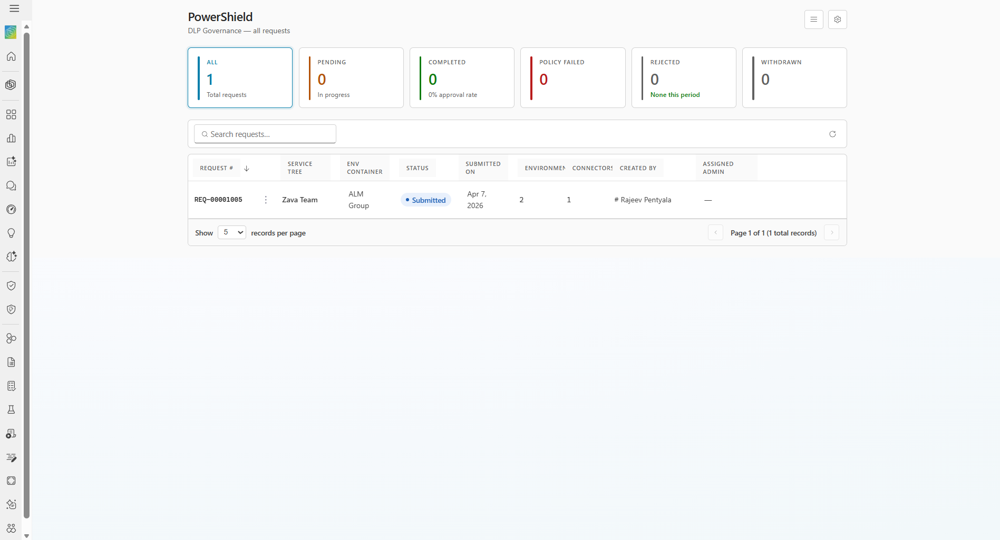

*Figure 1: PowerShield Admin home screen showing stat cards, request grid, and settings access*

## Key concepts

- **Policy Request**: A formal request submitted by a maker to gain access to specific connectors in one or more Power Platform environments. Each request follows a lifecycle from Draft through to Implemented (or Rejected/Withdrawn).
- **Service Tree**: An organizational grouping (e.g., department, team, project) that scopes policy requests. Makers must be a member of a Service Tree to submit requests under it.
- **Environment Container**: A named group of Power Platform environments within a Service Tree. When creating a request, makers select a container to define which environments the DLP policy applies to.
- **DLP Policy**: A Data Loss Prevention policy created in the Power Platform Admin Center. When an admin approves a request, PowerShield creates a scoped DLP policy that grants the requested connectors to the specified environments.
- **Connector Actions**: Individual operations within a connector (e.g., "Send Email", "Create Item"). Makers can granularly allow or block specific actions per connector in their request.
- **Custom Connector Patterns**: URL patterns for custom connectors that can be classified into DLP data groups (Business, Non-business, Blocked).
- **Compliance Questionnaire**: An optional, admin-configurable set of questions that makers must answer when submitting a request. Maker responses serve as decision points during approval.
- **Connector Governance (Default-Blocked Model)**: By default, all non-Microsoft-published connectors are blocked after the initial connector sync. Only connectors published by Microsoft are available to makers out of the box. Admins selectively unblock connectors they want to make available through the Connector Configurations screen. This ensures a secure-by-default posture where makers can only request access to explicitly approved connectors.

## Prerequisites

Before using PowerShield, ensure you have:

- **Copilot Studio Kit prerequisites**: All [prerequisites for the Copilot Studio Kit](PREREQUISITES.md) must be installed and configured.
- **Security roles**: Users must be assigned one of the following Dataverse security roles in the environment where the Copilot Studio Kit is hosted:
  - **PowerShield Maker** or **System Administrator** — for submitting and managing connector access requests (either role grants maker access)
  - **PowerShield Admin** — for reviewing, approving, and configuring PowerShield
- **System Administrator role in target environments**: Makers must have the System Administrator security role in each Power Platform environment they include in their request. This is validated during the wizard flow.

### Connection references

PowerShield uses two **HTTP with Microsoft Entra ID (preauthorized)** connection references that must be configured before the feature can operate. These connectors enable PowerShield to interact with the Power Platform APIs for environment discovery and DLP policy management.

#### 1. PowerShield APIFlow

This connector is used to read connector actions from the Power Platform Flow API.

| Setting | Value |
|---------|-------|
| **Display Name** | PowerShield APIFlow |
| **Connector** | HTTP with Microsoft Entra ID (preauthorized) |
| **Base Resource URL** | `https://api.flow.microsoft.com` |
| **Entra ID Resource URI** | `https://service.powerapps.com/` |

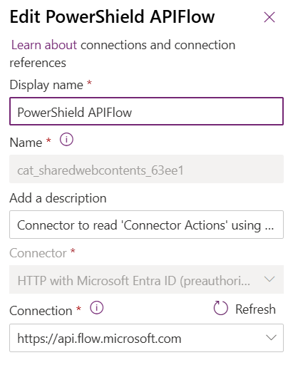

*Figure 2: PowerShield APIFlow connection reference configuration*

<br>


*Figure 3: HTTP with Microsoft Entra ID connection for APIFlow — Base Resource URL and Entra ID Resource URI settings*

#### 2. PowerShield BAPAPI

This connector is used to post connector actions and manage DLP policies via the Business Application Platform (BAP) API.

| Setting | Value |
|---------|-------|
| **Display Name** | PowerShield BAPAPI |
| **Connector** | HTTP with Microsoft Entra ID (preauthorized) |
| **Base Resource URL** | `https://api.bap.microsoft.com` |
| **Entra ID Resource URI** | `https://api.bap.microsoft.com` |

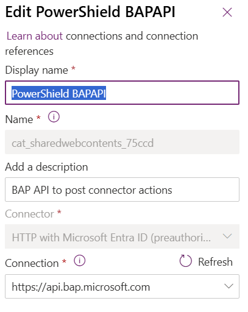

*Figure 4: PowerShield BAPAPI connection reference configuration*

<br>

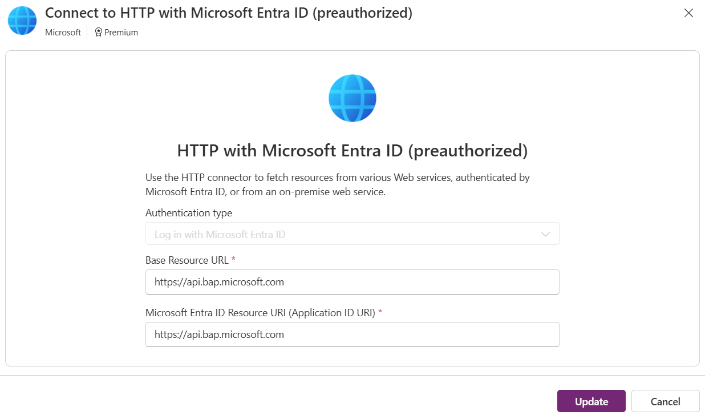

*Figure 5: HTTP with Microsoft Entra ID connection for BAPAPI — Base Resource URL and Entra ID Resource URI settings*

> **Important**: Both connection references must have active connections created by a user with appropriate Power Platform admin permissions. Without these connections, environment discovery and DLP policy fulfillment will fail.

### Connector and Connector Actions sync (Required)

PowerShield relies on two Dataverse tables — **Connectors** (`cat_connector`) and **Connector Actions** (`cat_connectoraction`) — that must be populated before the feature can be used. These tables serve as the connector catalog that makers browse when selecting connectors in the request wizard (Step 3). Without this data, the connector selection grid will be empty and no requests can be created.

Two scheduled cloud flows are responsible for populating and keeping these tables current:

| Cloud Flow | Purpose | What It Populates |
|------------|---------|-------------------|
| **Sync flow \| Connectors** | Discovers all available connectors in the tenant and syncs them into Dataverse. New non-Microsoft-published connectors are blocked by default (`Blocked by Admin = Yes`); Microsoft-published connectors are unblocked by default. Admin overrides are preserved on subsequent syncs. | `cat_connector` table — one row per connector with display name, publisher, tier (Premium/Standard), risk level, icon URL, connector key, blocked status, and active status |
| **Sync flow \| Connector Actions** | For each active connector, fetches the available actions (operations) from the Power Platform Flow API and syncs them into Dataverse. | `cat_connectoraction` table — one row per action with action name, action key, description, status (Allow/Block), and parent connector reference |

#### First-time setup

After installing the PowerShield solution:

1. Navigate to **Solutions > Copilot Studio Accelerator > Cloud flows** in your Power Platform environment.
2. Locate and **enable** the **"Sync flow | Connectors"** flow.
3. **Run the flow manually** (click "Run" in the flow details page) and wait for it to complete successfully.
4. Locate and **enable** the **"Sync flow | Connector Actions"** flow.
5. **Run the flow manually** and wait for it to complete successfully.
6. Verify the data by opening the **Connectors** (`cat_connector`) table in the model-driven app — you should see hundreds of connector records.
7. Verify the **Connector Actions** (`cat_connectoraction`) table — you should see action records for each connector.

> **Important**: These flows must run successfully **before** any maker can create a policy request. If the Connectors table is empty, the wizard's connector selection grid (Step 3) will show "No connectors found" and makers cannot proceed.

#### Ongoing sync

Both flows are designed to run on a **daily schedule** to keep the connector catalog current. New connectors added to the Power Platform and connector action changes are automatically synced during each run.

- **Connector sync** applies the **default-blocked model**: newly discovered non-Microsoft-published connectors are automatically set to `Blocked by Admin = Yes`. Microsoft-published connectors default to unblocked. Any admin overrides (block/unblock via Connector Configurations) are preserved and never overwritten by subsequent syncs.
- **Connector Actions sync** uses the `cat_UpsertConnectorActions` Dataverse Custom API to efficiently create, update, and deactivate action records. Stale actions (removed from the connector by Microsoft) are automatically deactivated.

> **Note**: Blocking or unblocking a connector through the **Connector Configurations** screen takes effect **immediately** — no sync is required. The daily sync only applies default blocking to newly discovered connectors.

## Roles and responsibilities

There are two main personas in PowerShield: the **Maker** and the **Admin**.

### Maker

Any Power Platform user assigned the **PowerShield Maker** or **System Administrator** Dataverse security role. The application treats both roles as a Maker — users with either (or both) roles receive the full maker experience.

- Create and submit new connector access requests via the 5-step wizard.
- Create and manage Service Trees and Environment Containers.
- View own requests and requests where they are a co-owner (participant).
- Save requests as drafts and resume them later.
- Withdraw a Draft or Submitted request.
- Clone an existing request to create a new one with the same configuration.
- Revise and resubmit a previously withdrawn request.
- Post comments with file attachments on own submitted requests.

### Admin

A user assigned the **PowerShield Admin** Dataverse security role. Admins are responsible for reviewing requests, managing governance configuration, and ensuring connector access aligns with organizational policies.

- View all requests across the tenant.
- Assign a request to themselves via **Assign to Me** (set to Under Review).
- Approve or reject requests (rejection requires a comment).
- View all request details including documents, questionnaire answers, and fulfillment logs.
- Manage connector configurations — selectively unblock connectors for maker use, assign risk levels, and configure action visibility.
- Configure the compliance questionnaire (categories, questions, answer options).
- Configure notification delivery settings (sender mailbox, admin distribution list, app URL).
- Post comments with file attachments on any non-Draft request.

## Get started

### Accessing PowerShield

PowerShield is accessed as an integrated feature within the Copilot Studio Kit. Navigate to the **Governance** section in the left navigation sidebar and click **Power Shield**.

### Role detection

When you first navigate to PowerShield, the system automatically detects your assigned security roles:

- **PowerShield Admin** role → Admin experience with all-tenant visibility and management controls
- **PowerShield Maker** or **System Administrator** role → Maker experience with personal request management
- **No recognized role** → An "Unauthorized" screen is displayed with instructions to contact your administrator

If a user has the Admin role alongside a Maker/System Administrator role, the Admin experience takes priority, though maker actions (like Withdraw on own requests) remain available.

## Maker workflow

### Home screen (Maker view)

The Maker home screen provides an overview of your connector access requests with quick stats, filtering, and quick actions.

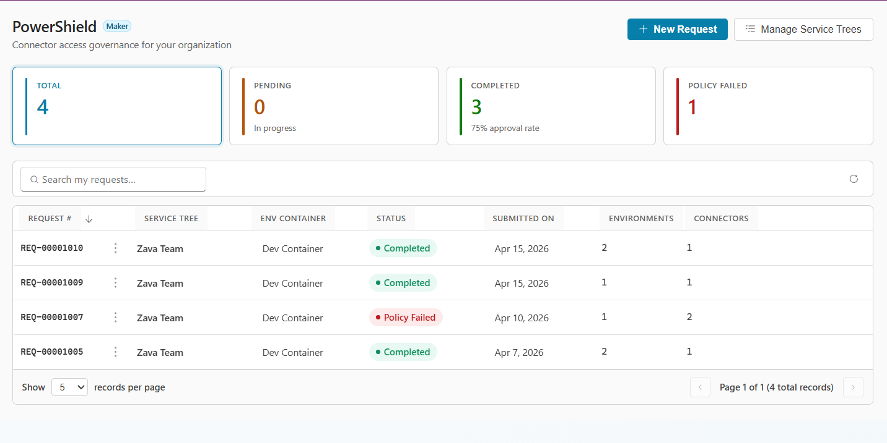

*Figure 6: Maker home screen showing stat cards, request grid, and header actions*

#### Header actions

The maker header includes two primary buttons:
- **+ New Request** — launch the 5-step request wizard
- **Manage Service Trees** — navigate to the Service Tree management page

#### Stat cards

Four stat cards at the top summarize your request portfolio:

| Card | Description |
|------|-------------|
| **Total** | Total count of all your requests |
| **Pending** | Requests currently under admin review |
| **Completed** | Approved and implemented requests, with approval rate percentage |
| **Policy Failed** | Requests where DLP policy implementation encountered errors |

Clicking a stat card filters the request grid to show only requests matching that status group.

#### Request grid

The grid displays your requests with the following columns:

| Column | Description |
|--------|-------------|
| Request # | Unique request identifier (e.g., REQ-00001010) with row action menu (⋮) |
| Service Tree | The organizational grouping for this request |
| Env Container | The environment container selected for this request |
| Status | Current lifecycle status (color-coded badge) |
| Submitted On | Date the request was submitted |
| Environments | Number of environments in the request |
| Connectors | Number of connectors requested |

Clicking a row navigates to the request detail view. The row action menu (⋮) provides quick access to **Clone** and **Withdraw** actions.

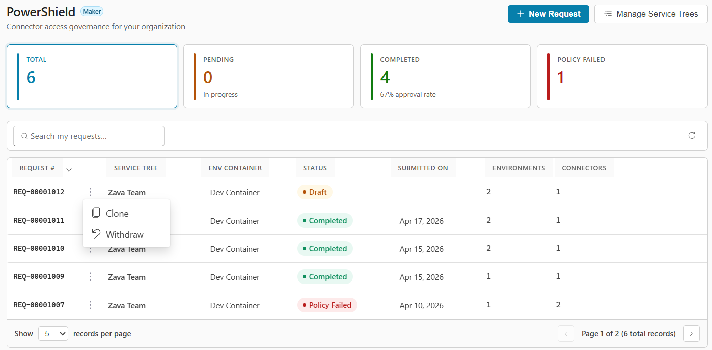

*Figure 7: Row action menu showing Clone and Withdraw options*

---

### Managing Service Trees

Service Trees represent organizational units, departments, or projects in your company. They are a prerequisite for creating policy requests — each request must be associated with a Service Tree.

#### Service Tree Management page

Navigate to **Manage Service Trees** from the maker home screen header to view and manage your Service Trees. You can also click **Take a tour** in the top-right corner for a guided walkthrough.

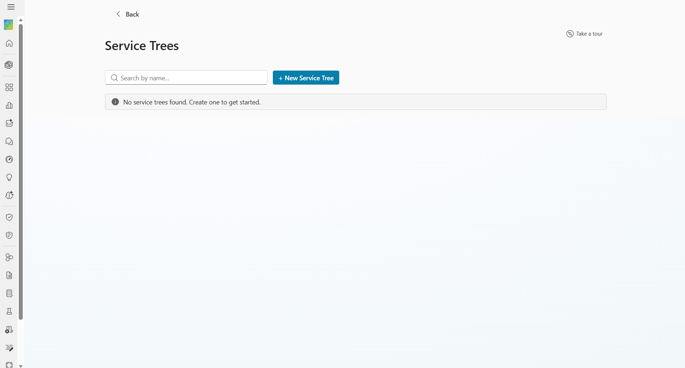

*Figure 8: Service Tree Management page — empty state with search bar and New Service Tree button*

The page uses a two-level drill-down:

1. **Level 1 — Service Trees list**: View all Service Trees where you are a member. Use the search bar to filter by name. Click a name to drill into its detail view.
2. **Level 2 — Service Tree detail**: View and edit the tree's details. Switch between the **Details** tab and the **Environment Containers** tab.

#### Creating a Service Tree

1. Click **+ New Service Tree** on the Service Trees list page or during the wizard (Step 1).
2. Fill in the required fields:
   - **Name** (required): Display name for the Service Tree
   - **Organization** (optional): Business unit or organization
   - **Description** (optional): Purpose or scope description
   - **Members**: Add active Dataverse users as members. Paste their username (e.g., `user@domain.com`) and click **+ Add**. You are automatically added as the first member and cannot be removed.

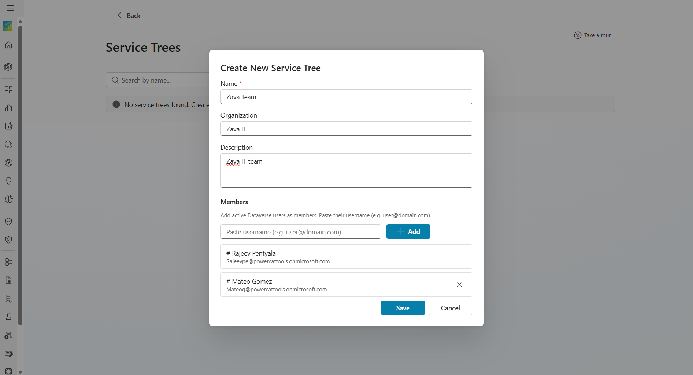

*Figure 9: Create New Service Tree dialog with name, organization, description, and member picker*

> **Note**: Only members of a Service Tree can see it and submit requests under it. The creator is always the first member and cannot be removed.

#### Managing Environment Containers

Environment Containers group Power Platform environments within a Service Tree. When creating a policy request, you select a container to define which environments the DLP policy applies to.

Navigate to a Service Tree's **Environment Containers** tab to manage containers.

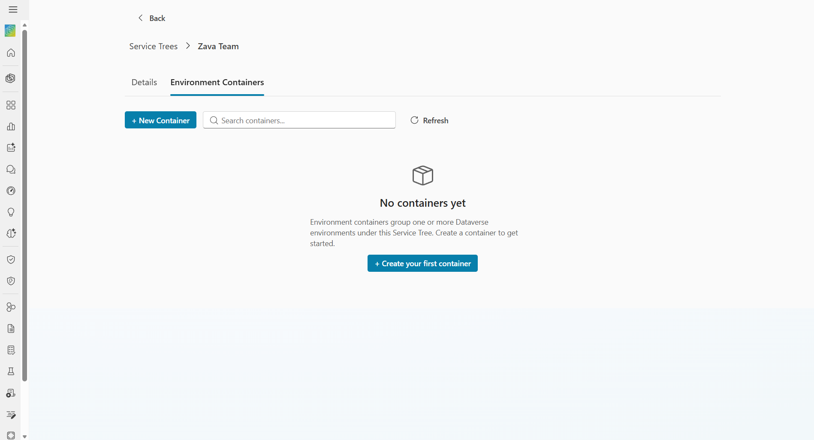

*Figure 10: Environment Containers tab — empty state with "No containers yet" illustration and create button*

When no containers exist, an illustrated empty state prompts you to **+ Create your first container**. The tab also provides **+ New Container**, a search bar, and a **Refresh** button.

To create a new container:

1. Navigate to a Service Tree's **Environment Containers** tab.
2. Click **+ New Container**.
3. In the dialog, fill in the required fields:
   - **Container name** (required): A display name for the container
   - **Description** (required): Description of the container's purpose
4. Search and filter available environments using the display name search, **Type** filter (Production, Sandbox, etc.), and **Location** filter.
5. Select one or more environments using the checkboxes. An info banner shows the count of selected environments (e.g., "2 environments selected. Selections are preserved across pages").
6. Use pagination to browse all available environments.
7. Click **Save**.

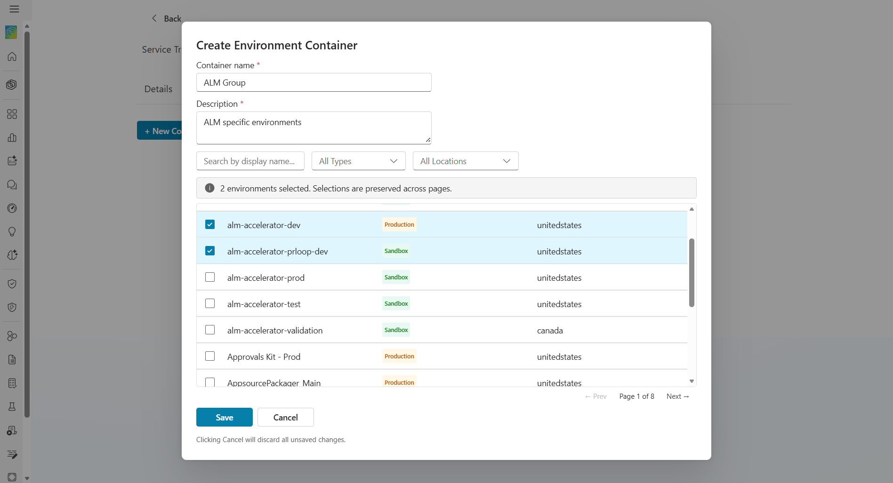

*Figure 11: Create Environment Container dialog — name, description, environment filters, and paginated selection list*

> **Note**: Clicking **Cancel** will discard all unsaved changes.

---

### Creating a new request (5-step wizard)

To request connector access, click **+ New Request** on the home screen. The wizard guides you through five steps. If no compliance questionnaire is configured by an admin, Step 2 is automatically skipped and the wizard shows four steps.

#### Step 1: Environment & Service Tree

Select the Service Tree and Environment Container for your request.

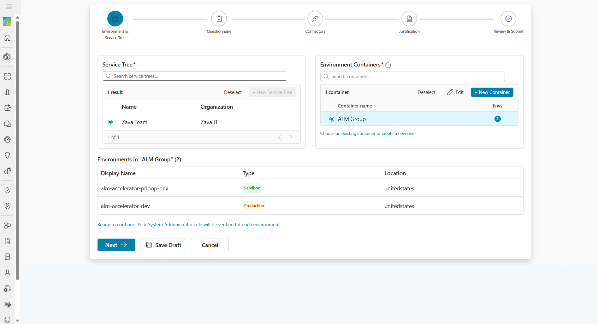

*Figure 12: Wizard Step 1 — selecting a Service Tree (left) and Environment Container (right), with selected container environments shown below*

**Service Tree selection** (left panel):
- Browse your available Service Trees in the grid (only trees where you are a member are shown).
- Select a tree by clicking its radio button.
- Click **+ New Service Tree** to create a new one inline.

**Environment Container selection** (right panel):
- After selecting a Service Tree, its containers appear in the right panel with a count (e.g., "1 container").
- Select a container by clicking its radio button. The container grid shows **Container name** and **Envs** (environment count badge).
- Click **Edit** to modify an existing container, or **+ New Container** to create a new one inline.
- The environments within the selected container are displayed in a read-only table below, showing **Display Name**, **Type** (badge: Sandbox, Production, etc.), and **Location**.

**Validation before proceeding:**
- A Service Tree must be selected.
- An Environment Container must be selected.
- No in-progress conflict (another non-terminal request exists for the same Service Tree).
- You must have the System Administrator role in each environment within the selected container.

A green "Ready to continue" message appears when all validations pass, noting that your System Administrator role will be verified for each environment.

> **Important**: When you click **Next**, PowerShield validates your System Administrator role in each environment. If you lack the required role in any environment, a dialog will inform you which environments are unauthorized.

#### Step 2: Compliance Questionnaire

> **Note**: This step is automatically skipped when no questionnaire questions have been configured by an admin.

Answer the compliance questions configured by your PowerShield Admin. Questions are grouped by category and may include various types:

- **Yes/No** radio button questions
- **Text** input fields
- **Single-select** dropdown choices
- **Multi-select** checkbox choices
- **Date** picker fields

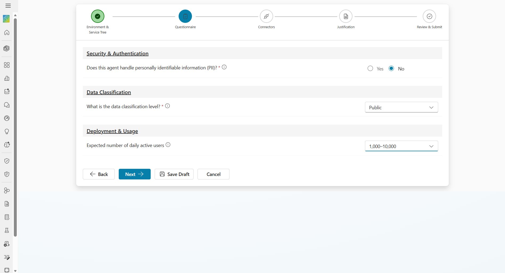

*Figure 13: Wizard Step 2 — compliance questionnaire with categorized questions*

Some questions may be conditional — they only appear when a parent question has a specific answer. Required questions are marked with an asterisk (*). Hover over the info (ℹ) icon next to a question for additional context provided by your admin.

#### Step 3: Connector Selection

Select the connectors you want included in your DLP policy.

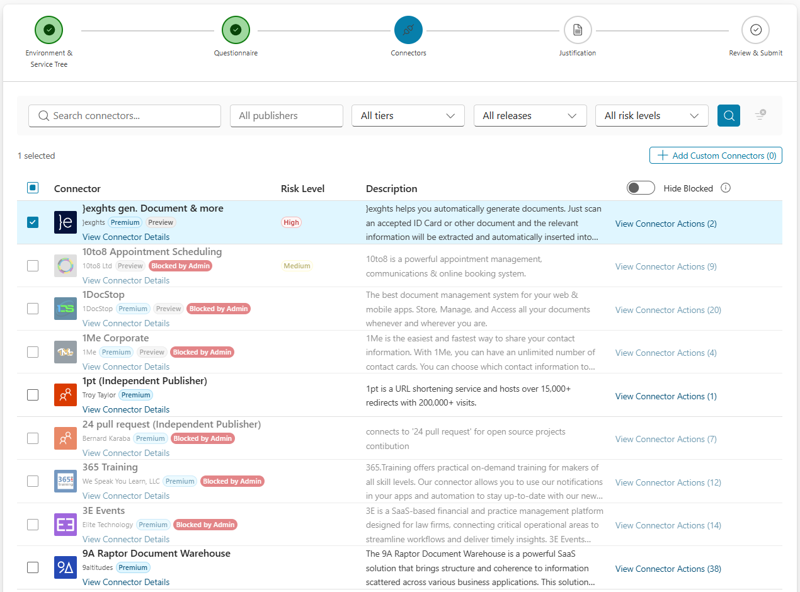

*Figure 14: Wizard Step 3 — connector selection grid with search, filters, and multi-select checkboxes*

**Filter controls:**
- **Publisher**: Filter by connector publisher.
- **Tier**: Filter by Premium or Standard (dropdown).
- **Release**: Filter by Production or Preview (dropdown).
- **Risk Level**: Filter by High, Medium, Low, Blocked, or None (dropdown).

**Connector grid columns:**
- Checkbox for selection
- Connector icon, name, publisher, and badges (Premium, Preview, Blocked by Admin)
- **Risk Level** (color-coded badge: High, Medium, etc.)
- **Description**
- **View Connector Actions** link with action count — click to configure per-action Allow/Block rules

Each connector row also includes a **View Connector Details** link for additional information.

**Hide Blocked toggle:** Use the **Hide Blocked** toggle to show or hide connectors that are blocked. By default, all non-Microsoft-published connectors are blocked until an admin explicitly unblocks them through Connector Configurations. Blocked connectors appear with a red "Blocked by Admin" badge and cannot be selected. Only connectors that have been unblocked by an admin (or Microsoft-published connectors, which are unblocked by default) are available for selection.

**Connector Actions dialog:**

Click **View Connector Actions** on any connector to see and configure its individual actions.

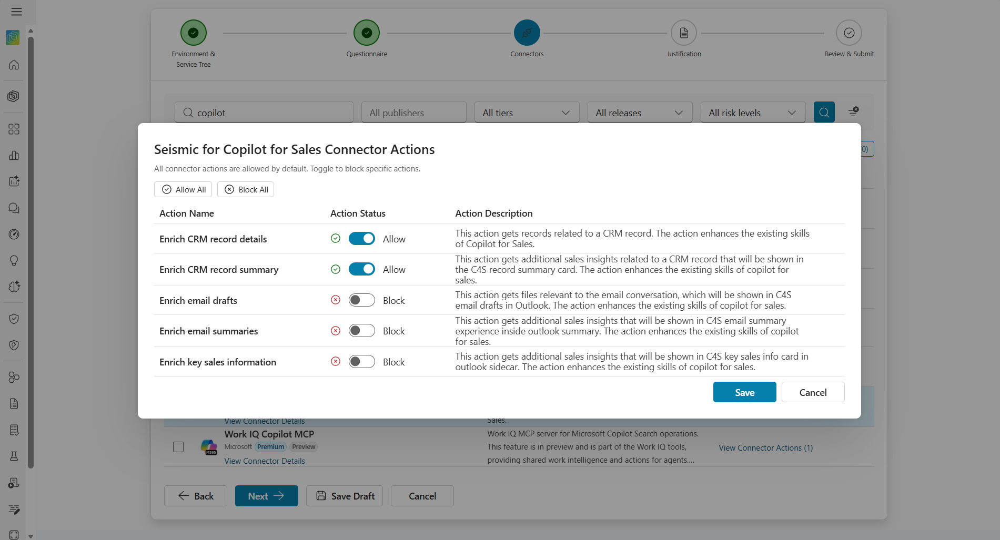

*Figure 15: Connector Actions dialog showing action-level Allow/Block toggles*

- A description notes: "All connector actions are allowed by default. Toggle to block specific actions."
- Use **Allow All** or **Block All** buttons for bulk configuration.
- Each action displays: **Action Name**, **Action Status** (toggle switch with Allow/Block label and status icon), and **Action Description**.
- Click **Save** to commit your overrides, or **Cancel** to discard.

**Custom Connector Patterns:**

Click **+ Add Custom Connectors (N)** in the toolbar to define URL patterns for custom connectors. The count in the button reflects the number of patterns already added.

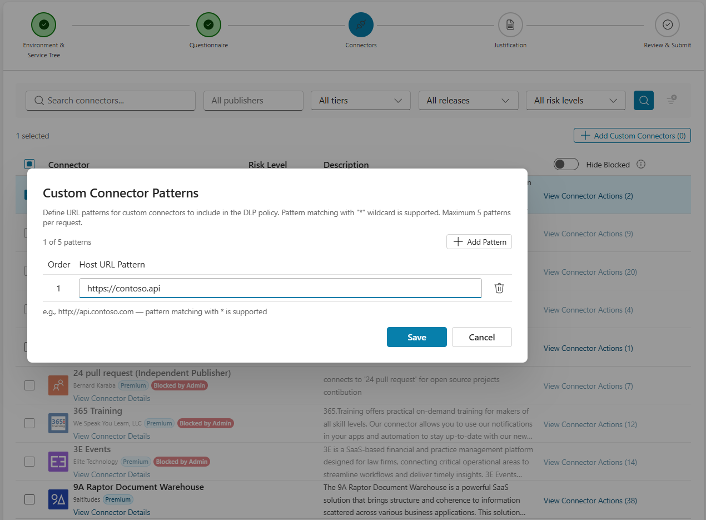

*Figure 16: Custom Connector Patterns dialog for defining URL patterns*

- A pattern counter (e.g., "1 of 5 patterns") tracks usage against the limit.
- Click **+ Add Pattern** to add a new row.
- Each pattern row has an **Order** number, a **Host URL Pattern** input field, and a delete (🗑) icon.
- A helper text below each input shows: "e.g., http://api.contoso.com — pattern matching with * is supported".
- Maximum 5 custom connector URL patterns per request.
- Click **Save** to commit, or **Cancel** to discard.

**Confirm Connector Selections:**

When you click **Next** on the connector step, a **Confirm Connector Selections** dialog appears summarizing your choices before proceeding.


*Figure 17: Confirm Connector Selections dialog showing selected connectors, blocked actions, and custom patterns*

The dialog displays:
- **Selected Connectors** (with count) — each connector listed with a checkmark
- **Blocked Actions** — any action-level blocks, shown as chips per connector (e.g., `scp-get-content-suggestions`)
- **Custom Connector Patterns** (with count) — each pattern with its data group badge (Business, Non-business, Blocked)

Click **Confirm & Continue** to proceed to the next step, or **Go Back** to make changes.

#### Step 4: Business Justification

Provide a business justification for your connector access request.

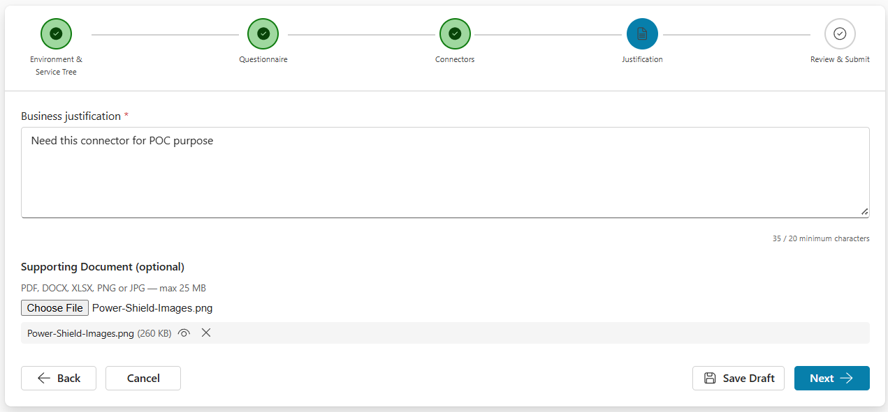

*Figure 18: Wizard Step 4 — business justification text area and optional supporting document upload*

- **Business justification** (required): Explain why you need these connectors. A character counter (e.g., "35 / 20 minimum characters") tracks progress toward the 20-character minimum.
- **Supporting Document** (optional): Attach a single file (PDF, DOCX, XLSX, PNG, or JPG, max 25 MB). After attaching, the file name and size (e.g., "260 KB") are displayed with a preview (👁) icon and a remove (×) icon.

#### Step 5: Review & Submit

Review your complete request before submission. This step uses a tabbed layout to organize all request details.

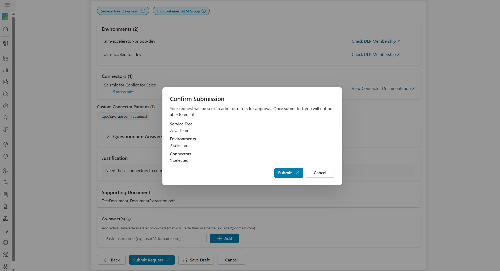

*Figure 19: Wizard Step 5 — Scope tab showing Service Tree, environments, and connectors*

**Service Tree and Environment Container** capsule badges are displayed at the top (clickable for details).

The review is organized into three tabs:

**Scope tab:**
- **Environments** — list of environments with **Check DLP Membership** links (opens Power Platform Admin Center)
- **Connectors** — selected connectors with expandable action rules (e.g., "2 action rules") and **View Connector Documentation** links
- **Custom Connector Patterns** (if any) — table showing Order, Host URL Pattern, and Data Group

**Details tab:**
- **Questionnaire Answers** (if questionnaire was completed)
- **Justification** text
- **Supporting Document** (if attached)

**Collaboration tab:**

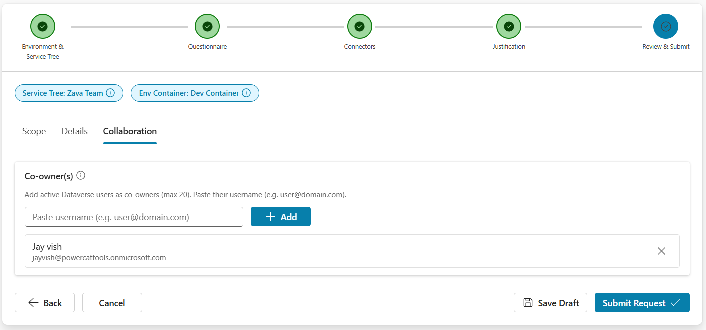

*Figure 20: Wizard Step 5 — Collaboration tab with co-owner management*

- **Co-owner(s)** — add active Dataverse users as co-owners who will receive read and write access to this request
- Paste a username (e.g., `user@domain.com`) and click **+ Add**
- Co-owner cards display the user's name and email, with a remove (×) icon
- You cannot add yourself or duplicate entries
- Maximum 20 co-owners per request

**Submitting:**
- Click **Submit Request ✓** to open the confirmation dialog.

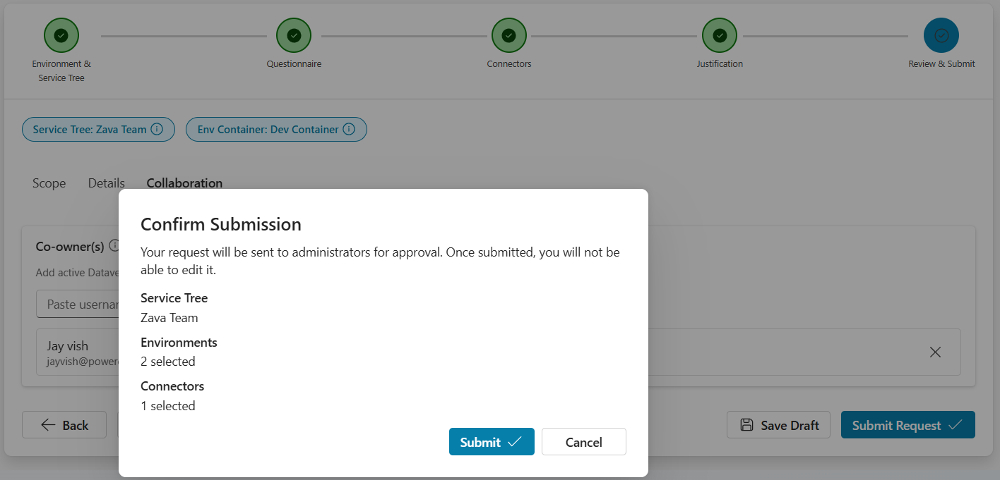

*Figure 21: Confirm Submission dialog showing request summary*

- The dialog reads: "Your request will be sent to administrators for approval. Once submitted, you will not be able to edit it."
- Displays the **Service Tree**, **Environments** count, and **Connectors** count.
- Click **Submit ✓** to finalize, or **Cancel** to return.

---

### Save Draft and Resume

You can save your request as a draft at any wizard step and return to it later.

- Click **Save Draft** in the wizard navigation bar (available on every step after Step 1 requirements are met).
- The draft is saved to Dataverse and you are navigated to the request detail view.
- To resume: open the draft request and click **Resume Draft**, or click the draft row on the home screen.
- The wizard reopens at the step where you left off, with all previously entered data restored.

> **Note**: Drafts do not enforce the full validation rules — you can save without completing required fields like justification or questionnaire answers.

---

### Withdraw a request

You can withdraw your own request if it is in Draft or Submitted status.

1. Open the request detail view or use the row action menu (⋮) on the home screen.
2. Click **Withdraw**.
3. Confirm the withdrawal in the dialog: *"Are you sure you want to withdraw request REQ-XXXXX? This cannot be undone."*
4. The request moves to **Withdrawn** status and becomes read-only.

> **Note**: Withdrawing a request does not block you from creating a new request for the same Service Tree.

---

### Revise and resubmit

If you have withdrawn a request, you can revise and resubmit it.

1. Open the withdrawn request detail view.
2. Click **Revise & Resubmit**.
3. Confirm in the dialog that a new request will be created with the withdrawn request's data copied across.
4. The wizard opens at Step 1 with all data pre-populated (except the supporting document, which must be re-attached).
5. Make any needed changes and submit the new request.

The original withdrawn request remains unchanged for audit purposes.

---

### Clone a request

You can clone any existing request to create a new draft with the same configuration.

1. On the home screen, click the row action menu (⋮) on any request row.
2. Select **Clone**.
3. Confirm in the dialog: *"A copy of REQ-XXXXXXX will be created with the same service tree, environment group, and connector configuration."*
4. A new Draft request is created and you are navigated to its detail view.

**What is copied:** Service Tree, Environment Container, environments, connectors (with action overrides), custom connector patterns, questionnaire answers, and justification.

**What is NOT copied:** Co-owners (participants) and supporting documents.

---

### Request detail view (Maker)

Click any request row on the home screen to view its full details.

The detail view has a tabbed layout:
- **Summary** tab: Full request details including Service Tree, environments, connectors, questionnaire answers, justification, supporting document, co-owners, and admin comment (if any).
- **Comments** tab (non-Draft requests only): Discussion thread for communicating with admins.

**Available actions by status:**

| Status | Available Actions |
|--------|-------------------|
| Draft | Resume Draft, Withdraw |
| Submitted | Withdraw |
| Withdrawn | Revise & Resubmit |
| All other statuses | Read-only |

---

### Comments and discussion

After a request is submitted, you can exchange messages with admins via the Comments tab. This provides a structured communication channel for clarification requests, additional evidence, and decision context.

- Comments are displayed in a vertical timeline layout (oldest first).
- Admin comments have a blue accent; maker comments have a neutral style.
- **Posting a comment**: Type your message in the compose box at the bottom and click **Send**.
- **Attaching files**: Click **Attach files** to add one or more files (PDF, DOCX, XLSX, PNG, JPG, max 25 MB each).
- **Previewing attachments**: Click the eye icon on any attachment to preview it in-app. Click the download icon to download.
- Comments are **immutable** — they cannot be edited or deleted after posting, ensuring a reliable audit trail.

---

## Admin workflow

### Home screen (Admin view)

The Admin home screen provides a tenant-wide view of all policy requests with management controls.


*Figure 22: Admin home screen showing 6 stat cards, all-tenant request grid, and settings gear icon*

#### Stat cards

Six stat cards summarize the tenant-wide request portfolio:

| Card | Description |
|------|-------------|
| **All** | Total requests across the tenant |
| **Pending** | Requests currently under review |
| **Completed** | Approved and implemented requests, with approval rate |
| **Policy Failed** | Requests where DLP policy implementation encountered errors |
| **Rejected** | Rejected requests |
| **Withdrawn** | Withdrawn requests |

Clicking a stat card filters the request grid to show only requests matching that status group.

#### Admin-specific controls

The admin header includes a **Settings** (⚙) gear icon in the top-right corner, which navigates to the [Settings Hub](#settings-hub) for centralized access to all admin configuration screens.

#### Admin grid

The admin grid displays all requests across the tenant with the following columns:

| Column | Description |
|--------|-------------|
| Request # | Unique request identifier with row action menu (⋮) |
| Service Tree | The organizational grouping for this request |
| Env Container | The environment container selected for this request |
| Status | Current lifecycle status (color-coded badge) |
| Submitted On | Date the request was submitted |
| Environments | Number of environments in the request |
| Connectors | Number of connectors requested |
| Created By | The user who submitted the request |
| Assigned Admin | The admin assigned to review the request (or "—" if unassigned) |

---

### Reviewinga request (Admin)

Open any request from the home screen to access the admin review interface.

The admin detail view has four tabs:
- **Summary** tab: Full request details (same as maker view).
- **Fulfillment** tab: DLP policy details and per-environment fulfillment status (admin-only).
- **Comments** tab: Discussion thread where admins can communicate with the maker.
- **Activity** tab: Fulfillment audit log showing DLP policy creation steps and results (admin-only).
- **Notifications** tab: Email notification history for this request (admin-only).

The request header shows the request number, status badge, submitted date, decided date (after approval/rejection), and assigned admin name.

#### Fulfillment tab

After a request is approved and DLP policy creation completes, the Fulfillment tab shows the policy details and per-environment status.

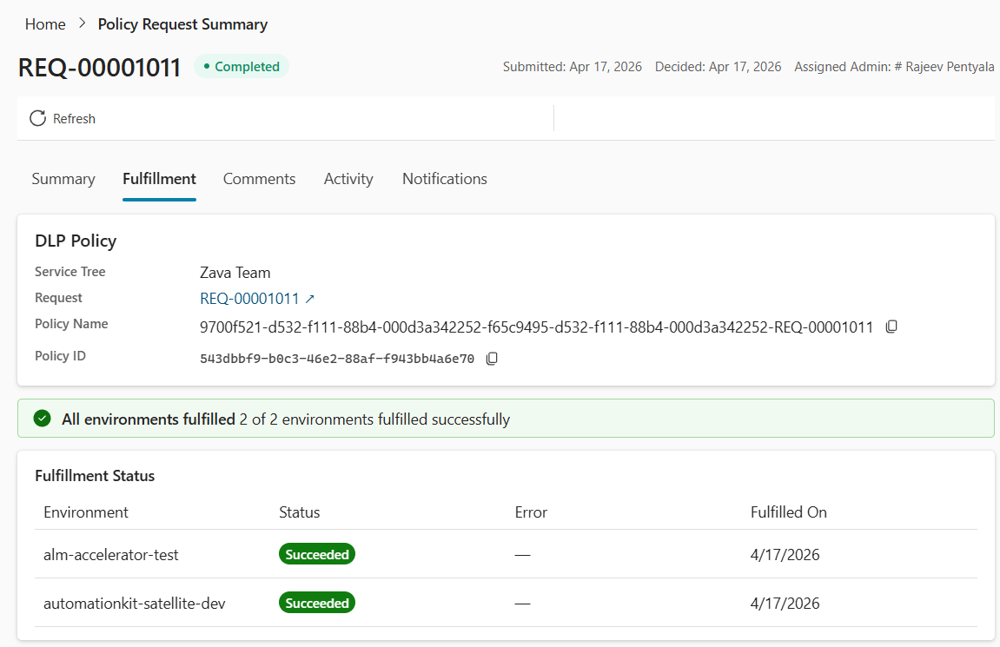

*Figure 23: Fulfillment tab showing DLP Policy details and per-environment fulfillment status*

**DLP Policy section:**
- **Service Tree** — name of the associated Service Tree
- **Request** — clickable request number link
- **Policy Name** — full DLP policy name with a copy (📋) button
- **Policy ID** — GUID of the created policy with a copy (📋) button

**Fulfillment status:**
- A summary banner shows the overall result (e.g., "All environments fulfilled — 2 of 2 environments fulfilled successfully")
- The **Fulfillment Status** table shows each environment with its **Status** (Succeeded badge), **Error** (or "—"), and **Fulfilled On** date

#### Assign to Me

When a request is in **Submitted** status, click **Assign to Me** (with info icon ℹ) to move it to **Under Review**. This signals to other admins that you are actively reviewing the request.

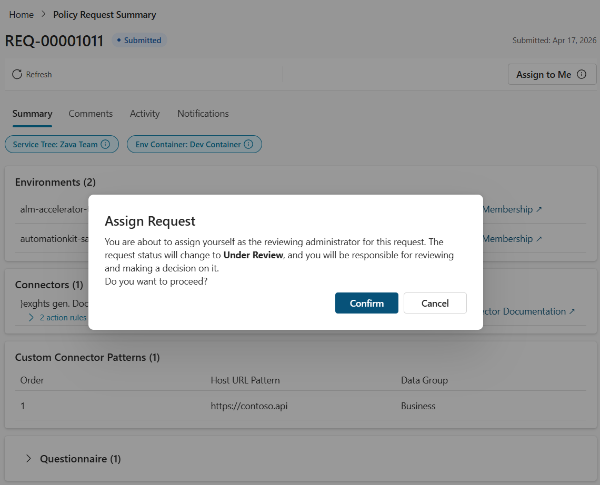

*Figure 24: Assign Request confirmation dialog*

The dialog reads: "You are about to assign yourself as the reviewing administrator for this request. The request status will change to **Under Review**, and you will be responsible for reviewing and making a decision on it."

Click **Confirm** to proceed, or **Cancel** to dismiss.

#### Approve a request

When a request is in **Submitted** or **Under Review** status, the approval flow uses a **2-step wizard**:

**Step 1 — Review (DLP Policy Impact):**

1. Click **Approve** in the request header.
2. A dialog shows the **DLP Policy Impact** pre-flight check:
   - If no existing policies are affected, a green success message is displayed (e.g., "No existing DLP policies will be affected. A new policy will be created covering N environment(s) with N approved connector(s).").
   - If existing policies will be modified, a warning lists the affected policies and environments to be reassigned.
   - If approving would leave an existing policy with zero environments, approval is **blocked** until the admin resolves the conflict in the Power Platform Admin Center.
   - If any requested connectors were **blocked by an admin after the maker submitted** the request, a warning highlights these connectors. The admin can choose to proceed (the blocked connectors will be excluded from the DLP policy) or go back.
3. Click **Next →** to proceed to Step 2, or **Cancel** to dismiss.

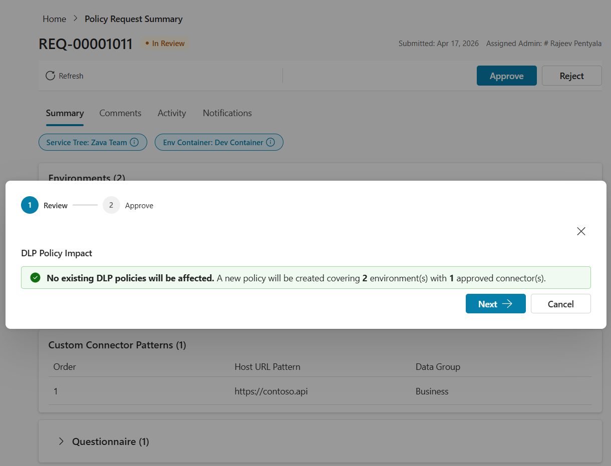

*Figure 25: Approval Step 1 — DLP Policy Impact review showing pre-flight check results*

**Step 2 — Approve (Confirmation):**

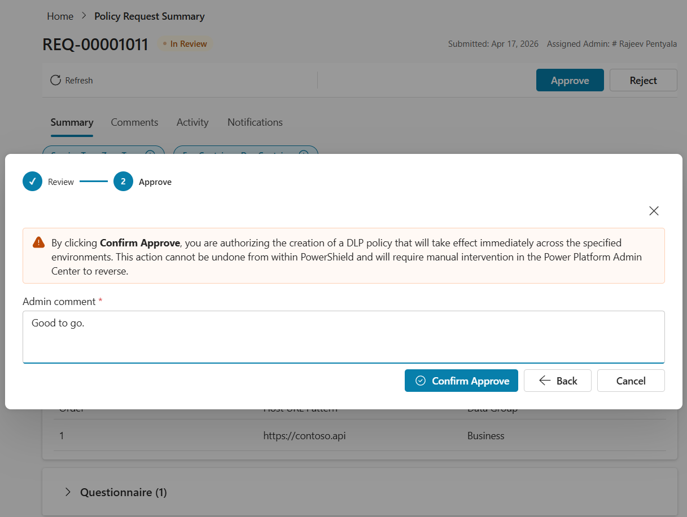

*Figure 26: Approval Step 2 — confirmation with required admin comment*

4. A warning banner explains: "By clicking **Confirm Approve**, you are authorizing the creation of a DLP policy that will take effect immediately across the specified environments. This action cannot be undone from within PowerShield and will require manual intervention in the Power Platform Admin Center to reverse."
5. Enter an **Admin comment** (required) — provide the rationale for approval.
6. Click **Confirm Approve** to finalize, **← Back** to return to Step 1, or **Cancel** to dismiss.

After approval, PowerShield automatically:
1. Sets the request status to **Implementing**.
2. Resolves conflicts with existing DLP policies.
3. Creates a new scoped DLP policy with the requested connectors and environments.
4. Updates the request status to **Implemented** (or **Policy Failed** if errors occur).

#### Reject a request

When a request is in **Submitted** or **Under Review** status:

1. Click **Reject**.
2. Add a **required** comment explaining the rejection reason.
3. Click **Confirm Reject**.
4. The request moves to **Rejected** status. The maker is notified and can view the rejection comment.

---

### Settings Hub

Navigate to the **Settings Hub** by clicking the gear (⚙) icon on the admin home screen.

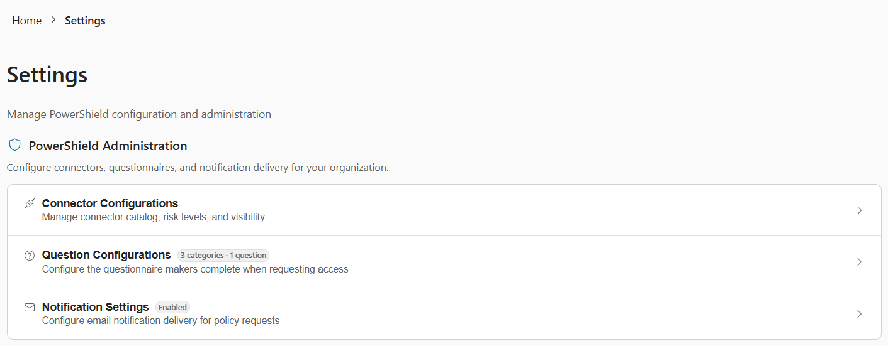

*Figure 27: Settings Hub — centralized navigation to all admin configuration screens*

The Settings Hub provides a centralized entry point for all PowerShield administration settings under the heading **PowerShield Administration** — "Configure connectors, questionnaires, and notification delivery for your organization."

Three navigation cards are available:

| Card | Description | Badge |
|------|-------------|-------|
| **Connector Configurations** | Manage connector catalog, risk levels, and visibility | — |
| **Question Configurations** | Configure the questionnaire makers complete when requesting access | Category/question count (e.g., "3 categories · 1 question") |
| **Notification Settings** | Configure email notification delivery for policy requests | Status badge (e.g., "Enabled") |

Click any card to navigate to the corresponding configuration screen.

---

### Connector Configurations

Navigate to **Connector Configurations** from the Settings Hub to browse and manage all connectors synced from your Power Platform environment.

> **Important — Default-Blocked Model**: After the initial connector sync, all non-Microsoft-published connectors are **blocked by default**. Only Microsoft-published connectors are available to makers out of the box. Use this screen to selectively **unblock** the connectors your organization wants to make available for maker requests. Blocking or unblocking a connector takes effect **immediately** — no sync is required.

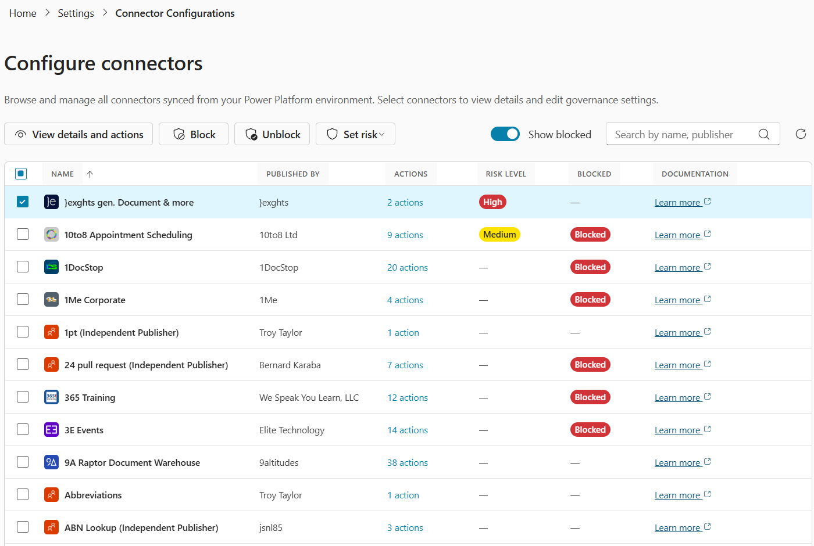

*Figure 28: Connector Configurations screen showing the full connector catalog with blocked status, risk levels, and documentation links*

**Toolbar actions:**
- **View details and actions** — open a detail panel for the selected connector
- **Block** — block the selected connector(s), preventing makers from requesting them
- **Unblock** — unblock the selected connector(s), making them available for maker requests
- **Set risk** — assign a risk level (High, Medium, Low, None) to the selected connector(s)
- **Show blocked** toggle — when ON, shows all connectors including blocked ones; when OFF, hides blocked connectors to focus on available ones
- **Search** — search by name or publisher

**Connector grid columns:**

| Column | Description |
|--------|-------------|
| Name | Connector display name with icon |
| Published By | Connector publisher |
| Actions | Number of available actions (clickable link) |
| Risk Level | Admin-assigned risk level badge (High, Medium, Low, or —) |
| Blocked | Blocked status badge (red "Blocked" or —). Non-Microsoft connectors show "Blocked" by default until explicitly unblocked |
| Documentation | "Learn more" link to the connector's official documentation |

**Connector detail panel:**

Click a connector row (or select it and click **View details and actions**) to open a detail panel on the right side showing:

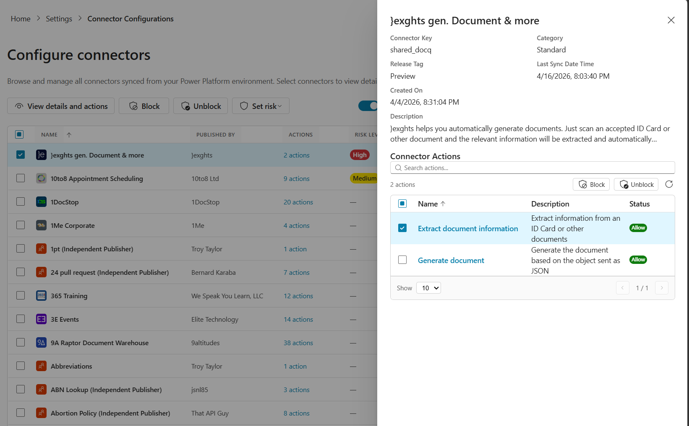

*Figure 29: Connector detail panel showing metadata and Connector Actions subgrid*

- **Connector Key** — internal connector identifier
- **Category** — Standard or Premium
- **Release Tag** — Production or Preview
- **Last Sync Date Time** — timestamp of the most recent sync
- **Created On** — record creation date
- **Description** — connector description

**Connector Actions subgrid** within the detail panel:
- Search actions by name
- **Block** and **Unblock** buttons for selected actions
- Refresh button
- Grid columns: **Name**, **Description**, **Status** (Allow/Block badge)

> **Note**: All blocking and unblocking changes (both at the connector level and individual action level) take effect **immediately**. No sync is required.

---

### Question Configuration

Navigate to **Question Configurations** from the Settings Hub to manage the compliance questionnaire.

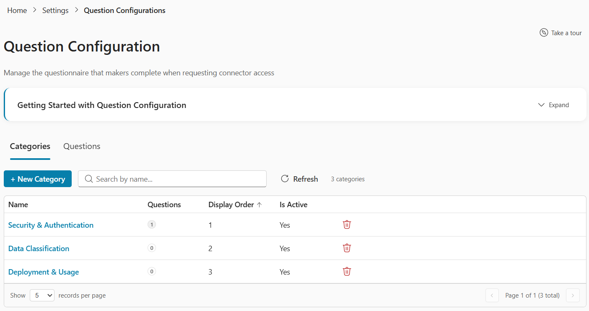

*Figure 30: Question Configuration screen with Getting Started guide, categories and questions tabs*

The questionnaire configured here appears in **Wizard Step 2** when makers submit connector access requests. Maker responses serve as decision points during the approval process.

**Getting Started guide:** An expandable "Getting Started with Question Configuration" section provides guidance on first setup. Click **Expand** to view the full guide.

**Two tabs organize the content:**
- **Categories** tab — manage category groupings (section headers in the maker's wizard)
- **Questions** tab — manage individual questions across all categories

> **Note**: The Copilot Studio Kit ships without any question data. When you first open Question Configuration, all grids will be empty. Click **Take a tour** in the top-right corner for a guided walkthrough.

#### Managing categories

Categories are section headers that group questions in the maker's wizard form.

- Click **+ New Category** to create a category with a name, display order, and active status.
- The categories grid shows: **Name** (clickable link), **Questions** (count badge), **Display Order**, **Is Active**, and a delete (🗑) icon.
- Click a category name to drill into its detail and manage questions within that category.
- Delete a category using the delete icon (only available if it has no questions).

#### Managing questions

Questions are the individual prompts shown to makers.

- Click **+ New Question** to create a question within a category.
- Configure the **Answer Type**: Boolean (Yes/No), Text, Choice (single-select), MultiselectChoice (multi-select), or Date.
- Set **Display Order** to control the position within its category.
- Mark as **Required** to make the answer mandatory for makers.
- Set a **Tooltip** for contextual help shown via an info icon.
- Configure **Conditional Logic**: Set a Parent Question and Trigger Value to make this question conditional — it only appears when the parent has a specific answer.

#### Managing answer options

For Choice and MultiselectChoice questions, define the available answer options.

- Click **+ New Option** to add an option with text, display order, and active status.
- Options appear as dropdown items (Choice) or checkbox items (MultiselectChoice) in the maker's wizard.

#### Guided tour

On your first visit, a guided tour introduces the Question Configuration interface. You can re-trigger it at any time by clicking **Take a tour** in the page header.

---

### Notification Settings

Navigate to **Notification Settings** from the Settings Hub to configure email notification delivery.

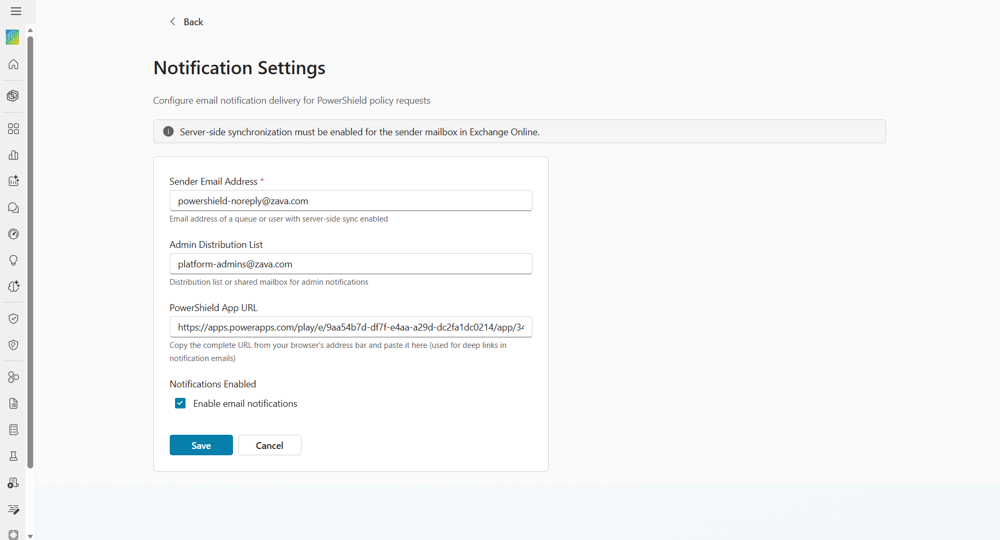

*Figure 31: Notification Settings screen with email configuration fields and helper text*

> **Note**: Server-side synchronization must be enabled for the sender mailbox in Exchange Online.

Configure the following settings to enable email notifications:

| Setting | Description | Required |
|---------|-------------|----------|
| **Sender Email Address** | Email address of a queue or user with server-side sync enabled | Yes |
| **Admin Distribution List** | Distribution list or shared mailbox for admin notifications | No |
| **PowerShield App URL** | Copy the complete URL from your browser's address bar and paste it here (used for deep links in notification emails) | No |
| **Notifications Enabled** | Checkbox to enable or disable all email notifications | — |

Click **Save** to apply changes, or **Cancel** to discard.

> **Important**: Without the Sender Email Address configured, all email notifications will silently fail. The admin home screen displays a warning banner if required settings are missing.

---

## Request status lifecycle

Each policy request follows a defined lifecycle with clear status transitions.

```
[New Wizard] ──── Save Draft ───→ Draft ←── Resume Draft
                                    │
                   Maker Withdraw ──┼──→ Withdrawn ──→ Revise & Resubmit (new request)
                                    │
                   Wizard Submit ───┼──→ Submitted
                                    │         │
                   Auto-Reject ─────┼──→ AutoRejected
                                    │
                   Admin Approve ───┼──→ Approved ──→ Implementing ──→ Implemented
                   Admin Reject ────┼──→ Rejected                    ↘ ImplementedWithErrors
                   Assign to Me ────┼──→ UnderReview
                                    │         │
                                    │   Admin Approve ──→ Approved
                                    │   Admin Reject  ──→ Rejected
```

### Status reference

| Status | Display Label | Description | Set By |
|--------|---------------|-------------|--------|
| Draft | Draft | Request saved but not yet submitted | Maker (Save Draft) |
| Submitted | Submitted | Request submitted for admin review | Maker (Wizard Submit) |
| UnderReview | In Review | Admin has taken ownership and is reviewing | Admin (Assign to Me) |
| Approved | Approved | Admin approved; DLP policy creation initiated | Admin (Approve) |
| Implementing | In Progress | DLP policy is being created | System (automatic) |
| Implemented | Completed | DLP policy successfully created | System (automatic) |
| ImplementedWithErrors | Policy Failed | DLP policy creation encountered errors | System (automatic) |
| Rejected | Rejected | Admin rejected the request | Admin (Reject) |
| AutoRejected | Auto Rejected | Automatically rejected by external flow | System (external flow) |
| Withdrawn | Withdrawn | Maker withdrew the request | Maker (Withdraw) |

### In-progress constraint

Only one active request can exist per Service Tree at a time. A new request is blocked if any existing request for the same Service Tree has status: Draft, Submitted, UnderReview, Approved, Implementing, or AutoRejected.

Terminal statuses (Withdrawn, Rejected, Implemented, ImplementedWithErrors) do **not** block new requests.

---

## Reference: Key Dataverse tables

PowerShield uses the following key Dataverse tables. All tables use the `cat_` publisher prefix.

### Master tables

| Table | Purpose |
|-------|---------|
| `cat_servicetree` | Maker-defined organizational groupings for scoping requests |
| `cat_connector` | Connector catalog (maintained by sync flow); non-Microsoft connectors blocked by default |
| `cat_connectoraction` | Individual actions per connector (maintained by sync flow) |
| `cat_questioncategory` | Admin-configurable questionnaire section headers |
| `cat_question` | Admin-configurable compliance questions |
| `cat_questionoption` | Answer options for Choice/MultiselectChoice questions |

### Transaction tables

| Table | Purpose |
|-------|---------|
| `cat_policyrequest` | Main request header with status, justification, and admin comment |
| `cat_policyrequestenvironment` | Selected environments per request with fulfillment tracking |
| `cat_policyrequestconnector` | Selected connectors per request with action overrides |
| `cat_policyrequestanswer` | Questionnaire answers with immutable question text snapshot |
| `cat_policyrequestparticipant` | Co-owners (participants) associated with a request |
| `cat_powershieldcustomconnectorpattern` | Custom connector URL patterns per request |
| `cat_powershieldpolicyrequestcomment` | Discussion thread comments on requests |
| `cat_powershieldpolicyrequestlog` | Append-only fulfillment audit log (admin-visible only) |

### Supporting tables

| Table | Purpose |
|-------|---------|
| `cat_powershieldenvironmentgroups` | Named environment containers scoped to a Service Tree |
| `cat_powershieldenvironmentgroupmembers` | Individual environments within a container |
| `cat_powershieldservicetreemembers` | Service Tree membership (users linked to trees) |
| `cat_powershieldsettings` | Key-value settings for notification configuration |

---

## FAQs and troubleshooting

### General questions

**Q: What happens after my request is approved?**

A: PowerShield automatically creates a scoped DLP policy in the Power Platform Admin Center. The request status progresses from Approved → Implementing → Implemented (or Policy Failed if errors occur). You can track the progress on the request detail view.

**Q: Can I edit a submitted request?**

A: No. Once a request is submitted, it cannot be edited. If you need to make changes, you can withdraw the request and create a new one using **Revise & Resubmit**, or clone it.

**Q: What does "Policy Failed" mean?**

A: This status indicates that the DLP policy creation or modification encountered an error. The admin can view the error details in the **Activity** tab of the request detail. Common causes include permission issues, environment conflicts, or Power Platform API errors.

**Q: How do I know which connectors are blocked?**

A: By default, all non-Microsoft-published connectors are blocked. In the connector selection grid (Step 3), blocked connectors appear with a red "Blocked by Admin" badge and cannot be selected. Use the **Hide Blocked** toggle to show or hide them. Your PowerShield Admin can unblock connectors through the Connector Configurations screen.

**Q: Why do I only see Microsoft connectors available for selection?**

A: PowerShield uses a secure-by-default model where all non-Microsoft-published connectors are blocked until an admin explicitly unblocks them. Contact your PowerShield Admin to request that specific connectors be unblocked through the Connector Configurations screen.

**Q: Can I request access for a Developer environment?**

A: No. Developer environments are automatically excluded from the environment list. Only Production, Sandbox, Trial, Default, and Teams environments are available.

**Q: What is the difference between the admin comment and the Comments thread?**

A: The **admin comment** is the formal decision record attached to an approval or rejection. It appears on the Summary tab. The **Comments thread** is a separate, ongoing discussion facility on the Comments tab for back-and-forth communication between maker and admin during the review process.

**Q: Why can't I see any Service Trees?**

A: You must be a member of a Service Tree to see it. Ask the Service Tree creator to add you as a member, or create a new Service Tree.

**Q: What is the System Administrator role validation?**

A: When you click Next on Step 1, PowerShield verifies that you have the System Administrator security role in each environment within your selected container. This is required because DLP policy changes require admin-level permissions. If you lack the role in any environment, you must either get the role assigned or select a different container.

### Admin questions

**Q: How do I configure the compliance questionnaire?**

A: Navigate to the **Settings Hub** (gear icon) → **Question Configurations**. Create categories (section headers), then add questions within each category. Configure answer types, conditional logic, and answer options. The questionnaire automatically appears in Step 2 of the maker's request wizard.

**Q: What happens if I approve a request that conflicts with existing DLP policies?**

A: The pre-flight dialog (Step 1 of the approval wizard) shows you which existing policies will be affected and which environments will be reassigned. If approving would leave an existing policy with zero environments, approval is blocked until you resolve the conflict in the Power Platform Admin Center. PowerShield handles conflict resolution automatically for non-blocking scenarios.

**Q: How do I unblock a connector for makers?**

A: Navigate to the **Settings Hub** (gear icon) → **Connector Configurations**. Use the **Show blocked** toggle to see all connectors, select the connector(s) you want to unblock, and click **Unblock** in the toolbar. The change takes effect immediately — no sync is required.

**Q: How do I block a connector?**

A: Navigate to the **Settings Hub** (gear icon) → **Connector Configurations**. Select the connector(s) and click **Block** in the toolbar. The change takes effect immediately. Note that all non-Microsoft-published connectors are already blocked by default after the initial sync — you typically only need to block a connector if it was previously unblocked.

**Q: Why are email notifications not being sent?**

A: Navigate to the **Settings Hub** (gear icon) → **Notification Settings**. Ensure the **Sender Email Address** is configured and **Notifications Enabled** is checked. Also verify that server-side synchronization is enabled for the sender mailbox in Exchange Online.

### Troubleshooting

**Issue: "No environments available" in the wizard**

- Ensure you have access to at least one Power Platform environment (non-Developer).
- Verify the PowerShield APIFlow connection is active and properly configured.
- Check that the connection user has the required permissions.

**Issue: "In-progress conflict" error when creating a request**

- Another active request (Draft, Submitted, Under Review, Approved, or Implementing) already exists for the same Service Tree.
- Wait for the existing request to reach a terminal status (Implemented, Rejected, Withdrawn), or withdraw it first.

**Issue: Request stuck in "Implementing" status**

- Check the **Activity** tab (admin only) for error details.
- Verify the PowerShield BAPAPI connection is active.
- Ensure the approving admin has Power Platform Admin permissions.
- If the fulfillment failed, the status may transition to **Policy Failed** — review the error details and retry.

**Issue: Cannot see the Settings Hub or admin configuration screens**

- These features are only available to users with the **PowerShield Admin** security role. Contact your Dataverse administrator to verify your role assignment.

**Issue: Connector icons not loading**

- Connector icons are loaded from external URLs. The Power Apps Content Security Policy may block some external image sources. A fallback plug icon is displayed when the original icon cannot load. This does not affect functionality.

**Issue: No connectors available for selection in wizard Step 3**

- By default, all non-Microsoft-published connectors are blocked. If makers only see Microsoft connectors (or none at all), your PowerShield Admin needs to unblock the relevant connectors through **Settings Hub** → **Connector Configurations**.
- Ensure the "Sync flow | Connectors" has run successfully at least once to populate the connector catalog.
