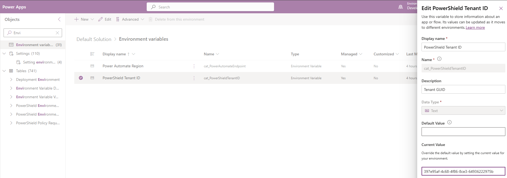

# Govern connector access with PowerShield

PowerShield enables organizations to manage Power Platform connector access through a structured, approval-based workflow for Data Loss Prevention (DLP) policies. Makers request connector access through a self-service wizard; admins review, approve, and manage those requests. Every DLP policy change is traceable to a PowerShield request, ensuring governance compliance and auditability.

## In this article

- [Key concepts](#key-concepts) — terminology and governance model
- [Prerequisites](#prerequisites) — roles, connections, and sync setup
- [Maker workflow](#maker-workflow) — request creation, drafts, and comments
- [Admin workflow](#admin-workflow) — review, approval, and settings
- [Request status lifecycle](#request-status-lifecycle) — statuses and transitions
- [Reference: Key Dataverse tables](#reference-key-dataverse-tables) — table catalog
- [Troubleshooting](#troubleshooting) — common issues and fixes

## Architecture

PowerShield is delivered as an embedded feature within two dedicated code apps and is also accessible from the model-driven app:

- **Copilot Studio Kit** (model-driven app) — launches PowerShield and routes to the appropriate code app based on the user's security role
- **Copilot Studio Kit for Makers** — submit and manage connector access requests
- **Copilot Studio Kit for Admins** — review, approve, and configure PowerShield


## Key concepts

- **Policy Request**: A maker's formal request to access specific connectors in one or more environments. Each request follows a lifecycle from Draft through Implemented (or Rejected/Withdrawn).
- **Service Tree**: An organizational grouping (department, team, or project) that scopes policy requests. Only members can submit requests under a Service Tree.
- **Environment Container**: A named group of Power Platform environments within a Service Tree that defines the DLP policy scope.
- **DLP Policy**: A Data Loss Prevention policy in the Power Platform Admin Center. Approved requests result in a scoped DLP policy for the requested connectors and environments.
- **Connector Actions**: Individual operations within a connector (e.g., "Send Email"). Makers can allow or block specific actions per connector.
- **Custom Connector Patterns**: URL patterns for custom connectors classified into DLP data groups (Business, Non-business, Blocked).
- **Compliance Questionnaire**: An optional, admin-configurable set of questions makers answer when submitting a request. Responses serve as decision points during approval.
- **Connector Governance (Default-Blocked Model)**: All non-Microsoft-published connectors are blocked after the initial sync. Only Microsoft-published connectors are available by default. Admins selectively unblock connectors through [Connector Configurations](#connector-configurations).

## Prerequisites

Before using PowerShield, ensure you have:

- **Copilot Studio Kit prerequisites**: All [prerequisites for the Copilot Studio Kit](PREREQUISITES.md) installed and configured for both code apps.
- **Security roles**: Users must be assigned one of the following Dataverse security roles:
  - **CSK - Maker** or **System Administrator** — maker experience in Copilot Studio Kit for Makers
  - **CSK - Administrator** or **System Administrator** — admin experience in Copilot Studio Kit for Admins
- **Power Platform Administrator role** (admins only): Admins who approve requests and create DLP policies must also have the **Power Platform Administrator** role assigned in the [Microsoft 365 admin center](https://admin.microsoft.com). This Microsoft Entra ID role grants permission to create, update, and delete DLP policies via the Power Platform for Admins connector. Without it, DLP policy creation fails after approval.

> [!WARNING]
> PowerShield **will not work** until the **PowerShield | Sync Connectors** and **PowerShield | Sync Connector Actions** cloud flows have each run at least once. These flows populate the connector catalog used in the request wizard (Step 3). See [Connector and Connector Actions sync](#connector-and-connector-actions-sync) for setup steps.

> [!NOTE]
> Developer environments are automatically excluded from PowerShield. Only Production, Sandbox, Trial, Default, and Teams environments are available.

### Connection references

PowerShield uses two **HTTP with Microsoft Entra ID (preauthorized)** connection references shared across both code apps for environment discovery and DLP policy management.

Each code app also registers its own platform connectors:

| Code App | Platform Connectors |
|----------|-------------------|
| **Copilot Studio Kit for Makers** | Microsoft Dataverse, Power Apps for Makers |
| **Copilot Studio Kit for Admins** | Microsoft Dataverse, Power Platform for Admins |

#### 1. PowerShield APIFlow

Reads connector actions from the Power Platform Flow API.

| Setting | Value |
|---------|-------|
| **Display Name** | PowerShield APIFlow |
| **Connector** | HTTP with Microsoft Entra ID (preauthorized) |
| **Base Resource URL** | `https://api.flow.microsoft.com` |
| **Entra ID Resource URI** | `https://service.powerapps.com/` |


*APIFlow connection reference*


*APIFlow connection details*

#### 2. PowerShield BAPAPI

Posts connector actions and manages DLP policies via the BAP API.

| Setting | Value |
|---------|-------|
| **Display Name** | PowerShield BAPAPI |
| **Connector** | HTTP with Microsoft Entra ID (preauthorized) |
| **Base Resource URL** | `https://api.bap.microsoft.com` |
| **Entra ID Resource URI** | `https://api.bap.microsoft.com` |


*BAPAPI connection reference*


*BAPAPI connection details*

### Environment variable

PowerShield requires one environment variable to be configured before cloud flows can manage DLP policies.

#### PowerShield Tenant ID

The **PowerShield Tenant ID** environment variable stores your Microsoft Entra tenant GUID. Cloud flows use this value to construct API calls to the Power Platform governance endpoint (for example, `https://api.bap.microsoft.com/providers/PowerPlatform.Governance/v1/tenants/{tenantId}/policies/...`).

**To configure the environment variable:**

1. Open the [Power Apps maker portal](https://make.powerapps.com) and select your environment.
2. Navigate to **Solutions > Default Solution > Environment variables**.
3. Locate **PowerShield Tenant ID** (`cat_PowerShieldTenantID`).
4. Select the variable, then enter your tenant GUID in the **Current Value** field.
5. Select **Save**.



*PowerShield Tenant ID environment variable*

> [!TIP]
> To find your Tenant ID, sign in to [Power Apps](https://make.powerapps.com), select the **Settings** (gear) icon on the command bar, and then select **Session details**. The **Tenant ID** is displayed in the session details dialog. For more information, see [Get session and app ID details](https://learn.microsoft.com/power-apps/maker/canvas-apps/get-sessionid).

### Connector and Connector Actions sync

PowerShield relies on two Dataverse tables — **Connectors** (`cat_connector`) and **Connector Actions** (`cat_connectoraction`) — that must be populated before the feature can be used. Two scheduled cloud flows keep these tables current:

| Cloud Flow | Purpose | Target Table |
|------------|---------|--------------|
| **PowerShield \| Sync Connectors** | Discovers all tenant connectors. Applies the [default-blocked model](#key-concepts): new non-Microsoft connectors are blocked by default; admin overrides are preserved. | `cat_connector` |
| **PowerShield \| Sync Connector Actions** | Fetches available actions per active connector from the Flow API. | `cat_connectoraction` |

#### First-time setup

After installing the Copilot Studio Kit solution:

1. Navigate to **Solutions > Copilot Studio Accelerator > Cloud flows**.
2. Enable and **run manually** the **"PowerShield | Sync Connectors"** flow. Wait for completion.
3. Enable and **run manually** the **"PowerShield | Sync Connector Actions"** flow. Wait for completion.
4. Verify: open the **Connectors** (`cat_connector`) table — you should see hundreds of records.
5. Verify: open the **Connector Actions** (`cat_connectoraction`) table — you should see action records.

#### Ongoing sync

Both flows run on a **daily schedule**. The connector sync preserves admin overrides (block/unblock). The actions sync uses `cat_UpsertConnectorActions` to efficiently create, update, and deactivate records.

## Roles and responsibilities

### Maker

Requires the **CSK - Maker** or **System Administrator** security role. Access PowerShield through the **Copilot Studio Kit for Makers** app (a **[Maker]** badge displays in the header).

Makers can:

- Create and submit connector access requests via the 5-step wizard
- Create and manage Service Trees and Environment Containers
- View own requests and requests where they're a co-owner
- Save drafts and resume later
- Withdraw, clone, or revise and resubmit requests
- Post comments with file attachments on submitted requests

### Admin

Requires the **CSK - Administrator** or **System Administrator** security role. Access PowerShield through the **Copilot Studio Kit for Admins** app (an **[Admin]** badge displays in the header).

> [!IMPORTANT]
> To approve requests and create DLP policies, admins also need the **Power Platform Administrator** role assigned in the [Microsoft 365 admin center](https://admin.microsoft.com). The Dataverse security role controls app access; the Power Platform Administrator role controls DLP policy operations.

Admins can:

- View all requests across the tenant
- Assign requests to themselves (**Assign to Me**)
- Approve or reject requests (rejection requires a comment)
- View fulfillment logs and notification history
- Manage [Connector Configurations](#connector-configurations), [Question Configuration](#question-configuration), and [Notification Settings](#notification-settings)
- Post comments with file attachments on any request

> [!NOTE]
> Users with the **System Administrator** role have access to both apps.

## Get started

### Launch options

PowerShield is accessible from three apps within the Copilot Studio Kit solution. Choose the launch option that matches your role and workflow.

| App | Type | Audience | Internal name |
|-----|------|----------|---------------|
| Copilot Studio Kit | Model-Driven App | All users (auto-routes by role) | `cat_CopilotStudioAccelerator` |
| Copilot Studio Kit for Admins | Code App | Admins | `cat_copilotstudiokitforadmins` |
| Copilot Studio Kit for Makers | Code App | Makers | `cat_copilotstudiokitformakers` |

#### Option A: Launch from the Copilot Studio Kit model-driven app

This option is recommended for organizations that use the Copilot Studio Kit model-driven app as the central hub.

1. Open the **Copilot Studio Kit** model-driven app.
2. In the left navigation, expand the **Governance** area.
3. Select **PowerShield**.
4. The unified launcher detects your security role and routes you to the appropriate code app:
   - Users with the **CSK - Administrator** or **System Administrator** role are redirected to **Copilot Studio Kit for Admins**.
   - Users with the **CSK - Maker** role are redirected to **Copilot Studio Kit for Makers**.
   - If a user has both admin and maker roles, the admin app takes precedence.

#### Option B: Launch from Copilot Studio Kit for Admins

Use this option when you manage connector access requests directly in the admin code app.

1. Open the **Copilot Studio Kit for Admins** code app.
2. In the left sidebar, navigate to the **Governance** section.
3. Select **Power Shield**.

The admin experience includes request review, approval workflows, connector configurations, question configuration, and notification settings.

#### Option C: Launch from Copilot Studio Kit for Makers

Use this option when you submit connector access requests directly in the maker code app.

1. Open the **Copilot Studio Kit for Makers** code app.
2. In the left sidebar, navigate to the **Governance** section.
3. Select **Power Shield**.

The maker experience includes request creation via the 5-step wizard, service tree management, and request tracking.

## Maker workflow

> [!NOTE]
> All maker workflow takes place within the **Copilot Studio Kit for Makers** code app.

### Home screen (Maker view)

The home screen provides an overview of your connector access requests.


*Maker home screen*

**Header actions:** **+ New Request** (launch the wizard) and **Manage Service Trees**.

**Stat cards:** Four cards summarize your request portfolio — **Total**, **Pending**, **Completed** (with approval rate), and **Policy Failed**. Click a card to filter the grid.

**Request grid:** Lists your requests with status, service tree, environment container, connector counts, and submission date. Click a row for details. Use the row action menu (⋮) for quick **Clone** and **Withdraw** actions.


*Row action menu*

### Managing Service Trees

Service Trees represent organizational units, departments, or projects. Each request must be associated with a Service Tree.

#### Service Tree Management page

Navigate to **Manage Service Trees** from the home screen header. Click **Take a tour** for a guided walkthrough.


*Service Tree Management page*

The page uses a two-level drill-down:

1. **Service Trees list** — view all trees where you're a member. Search by name. Click to drill in.
2. **Service Tree detail** — view and edit details across the **Details** and **Environment Containers** tabs.

#### Creating a Service Tree

1. Click **+ New Service Tree** on the list page or during the wizard (Step 1).
2. Fill in the fields:
   - **Name** (required)
   - **Organization** (optional)
   - **Description** (optional)
   - **Members**: Paste a username (e.g., `user@domain.com`) and click **+ Add**. You're automatically the first member.


*Create New Service Tree dialog*

> [!NOTE]
> Only members of a Service Tree can see it and submit requests under it.

#### Managing Environment Containers

Environment Containers group Power Platform environments within a Service Tree. Navigate to a Service Tree's **Environment Containers** tab.


*Environment Containers tab (empty state)*

To create a container:

1. Click **+ New Container**.
2. Enter a **Container name** (required) and **Description** (required).
3. Filter environments by display name, **Type** (Production, Sandbox, etc.), and **Location**.
4. Select one or more environments using checkboxes.
5. Click **Save**.


*Create Environment Container dialog*

### Creating a new request (5-step wizard)

Click **+ New Request** on the home screen. The wizard guides you through five steps. If no compliance questionnaire is configured, Step 2 is automatically skipped.

#### Step 1: Environment & Service Tree

Select the Service Tree and Environment Container for your request.


*Step 1 — Service Tree and Environment Container selection*

- **Left panel**: Select a Service Tree (only trees where you're a member). Create new ones inline with **+ New Service Tree**.
- **Right panel**: Select a container. Edit existing containers or create new ones inline. The environments in the selected container display in a read-only table below.

**Validation requirements:**
- A Service Tree and Environment Container must be selected.
- No in-progress conflict (another active request for the same Service Tree).
- You must have the System Administrator role in each environment.

> [!IMPORTANT]
> Clicking **Next** validates your System Administrator role in each environment. Unauthorized environments are flagged in a dialog.

#### Step 2: Compliance Questionnaire

> [!NOTE]
> Skipped automatically when no questionnaire is configured by an admin.

Answer the compliance questions grouped by category. Supported types: Yes/No, Text, Single-select, Multi-select, and Date. Some questions may be conditional. Required questions are marked with an asterisk (*).


*Step 2 — compliance questionnaire*

#### Step 3: Connector Selection

Select the connectors for your DLP policy. Filter by publisher, tier, release, and risk level.


*Step 3 — connector selection grid*

Use the **Hide Blocked** toggle to show or hide connectors blocked by an admin. Blocked connectors display a red "Blocked by Admin" badge and can't be selected (see [Connector Governance](#key-concepts)).

**Connector Actions:** Click **View Connector Actions** on any connector to configure per-action Allow/Block rules. Use **Allow All** or **Block All** for bulk changes.


*Connector Actions dialog*

**Custom Connector Patterns:** Click **+ Add Custom Connectors** to define URL patterns (maximum 5 per request).


*Custom Connector Patterns dialog*

**Confirm selections:** Clicking **Next** opens a confirmation dialog summarizing selected connectors, blocked actions, and custom patterns.


*Confirm Connector Selections dialog*

#### Step 4: Business Justification


*Step 4 — business justification*

- **Business justification** (required): 20-character minimum.
- **Supporting Document** (optional): Single file (PDF, DOCX, XLSX, PNG, or JPG, max 25 MB).

#### Step 5: Review & Submit

Review your request across three tabs before submission.


*Step 5 — review (Scope tab)*

- **Scope tab** — environments (with **Check DLP Membership** links), connectors (with expandable action rules), and custom patterns
- **Details tab** — questionnaire answers, justification, and supporting document
- **Collaboration tab** — add co-owners (maximum 20) who receive read/write access to this request


*Collaboration tab — co-owner management*

Click **Submit Request ✓** to open the confirmation dialog, then **Submit ✓** to finalize. Submitted requests can't be edited.


*Confirm Submission dialog*

> [!NOTE]
> The **admin comment** (formal decision record on the Summary tab) is distinct from the **Comments thread** (ongoing discussion on the Comments tab).

### Save Draft and Resume

Save your request as a draft at any wizard step and return later.

- Click **Save Draft** (available after Step 1 requirements are met).
- To resume: open the draft and click **Resume Draft**, or select the draft row on the home screen.
- The wizard reopens at the step where you left off with all data restored.

> [!NOTE]
> Drafts don't enforce full validation — you can save without completing required fields.

### Withdraw a request

Withdraw a request in **Draft** or **Submitted** status.

1. Open the request detail view or use the row action menu (⋮).
2. Click **Withdraw** and confirm.
3. The request moves to **Withdrawn** status (read-only).

### Revise and resubmit

Revise a withdrawn request:

1. Open the withdrawn request and click **Revise & Resubmit**.
2. Confirm that a new request will be created with the previous data.
3. The wizard opens at Step 1 with pre-populated data (re-attach the supporting document).
4. Make changes and submit.

The original withdrawn request remains unchanged for audit purposes.

### Clone a request

Clone any request to create a new draft with the same configuration.

1. Click the row action menu (⋮) → **Clone** → confirm.
2. A new Draft request is created.

**Copied:** Service Tree, Environment Container, environments, connectors (with action overrides), custom patterns, questionnaire answers, and justification. **Not copied:** co-owners and supporting documents.

### Request detail view (Maker)

Click any request row to view its details across two tabs:

- **Summary** — full request details, co-owners, and admin comment
- **Comments** (after submission) — discussion thread with admins

| Status | Available Actions |
|--------|-------------------|
| Draft | Resume Draft, Withdraw |
| Submitted | Withdraw |
| Withdrawn | Revise & Resubmit |
| All other statuses | Read-only |

### Comments and discussion

Exchange messages with admins via the Comments tab after submission.

- Comments display in a vertical timeline (oldest first). Admin comments have a blue accent.
- Attach files (PDF, DOCX, XLSX, PNG, JPG, max 25 MB each) and preview them in-app.
- Comments are **immutable** — they can't be edited or deleted, ensuring a reliable audit trail.

## Admin workflow

> [!NOTE]
> All admin workflow takes place within the **Copilot Studio Kit for Admins** code app.

### Home screen (Admin view)

The admin home screen provides a tenant-wide view of all policy requests.


*Admin home screen*

**Stat cards:** Six cards — **All**, **Pending**, **Completed** (with approval rate), **Policy Failed**, **Rejected**, **Withdrawn**. Click a card to filter the grid.

**Settings:** Click the gear (⚙) icon to access the [Settings Hub](#settings-hub).

**Admin grid:** Displays all tenant requests with the same columns as the maker grid, plus **Created By** and **Assigned Admin**.

### Settings Hub

Click the gear (⚙) icon on the admin home screen to configure PowerShield before processing requests.


*Settings Hub*

Three configuration areas:

| Card | Description |
|------|-------------|
| **Connector Configurations** | Manage connector catalog, risk levels, and blocked status |
| **Question Configurations** | Configure the compliance questionnaire |
| **Notification Settings** | Configure email notification delivery |

### Connector Configurations

Browse and manage all connectors synced from your Power Platform environment. Blocking and unblocking changes apply **immediately** — no sync required.

> [!NOTE]
> Non-Microsoft connectors are [blocked by default](#key-concepts). Use this screen to selectively unblock connectors for maker requests.


*Connector Configurations*

**Toolbar:** View details and actions, Block, Unblock, Set risk level, Show blocked toggle, Search.

**Connector detail panel:** Click a connector to view metadata (key, category, release tag, sync date, description) and manage individual **Connector Actions** with per-action Block/Unblock controls.


*Connector detail panel*

### Question Configuration

Manage the compliance questionnaire that appears in the maker's wizard (Step 2).


*Question Configuration*

The interface has two tabs:

- **Categories** — section headers that group questions. Create with **+ New Category** (name, display order, active status).
- **Questions** — individual prompts. Configure answer type (Boolean, Text, Choice, MultiselectChoice, Date), display order, required flag, tooltip, and conditional logic (parent question + trigger value).

For Choice and MultiselectChoice questions, define answer options with **+ New Option**.

> [!NOTE]
> The kit ships without question data. Click **Take a tour** for a guided walkthrough.

### Notification Settings

Configure email notification delivery.


*Notification Settings*

| Setting | Description | Required |
|---------|-------------|----------|
| **Sender Email Address** | Queue or user mailbox with server-side sync enabled | Yes |
| **Admin Distribution List** | Distribution list or shared mailbox for admin notifications | No |
| **PowerShield App URL** | Full app URL for deep links in emails | No |
| **Notifications Enabled** | Enable or disable all email notifications | — |

> [!IMPORTANT]
> Without the Sender Email Address configured, all email notifications silently fail. Ensure server-side synchronization is enabled for the sender mailbox in Exchange Online.

### Reviewing a request (Admin)

The admin detail view has five tabs:

- **Summary** — full request details (same as maker view)
- **Fulfillment** — DLP policy details and per-environment fulfillment status
- **Comments** — discussion thread with the maker
- **Activity** — fulfillment audit log
- **Notifications** — email notification history

#### Assign to Me

Click **Assign to Me** on a **Submitted** request to move it to **Under Review**, signaling to other admins that you're reviewing it.


*Assign Request dialog*

#### Approve a request

Approval uses a **2-step wizard** for requests in **Submitted** or **Under Review** status:

**Step 1 — DLP Policy Impact review:**

1. Click **Approve**.
2. The dialog shows a pre-flight check:
   - **No conflicts** — green success message with environment and connector counts.
   - **Existing policies affected** — warning listing affected policies and environments.
   - **Zero-environment conflict** — approval is **blocked** until the admin resolves the conflict in the Power Platform Admin Center.
   - **Post-submission blocked connectors** — warning that these connectors will be excluded.
3. Click **Next →** to proceed.


*Approval Step 1 — DLP Policy Impact*

**Step 2 — Confirmation:**


*Approval Step 2 — confirmation*

4. Review the warning: approving creates an immediate, irreversible DLP policy (reversible only via the Power Platform Admin Center).
5. Enter a required **Admin comment**.
6. Click **Confirm Approve**.

After approval, PowerShield automatically sets the status to **Implementing**, resolves DLP conflicts, creates the scoped policy, and updates to **Implemented** (or **Policy Failed** on error).

> [!NOTE]
> DLP policy creation requires the approving admin to have the **Power Platform Administrator** role. If the role is missing, the request transitions to **Policy Failed** status with a permission error. See [Troubleshooting](#troubleshooting) for resolution steps.

#### Reject a request

1. Click **Reject** on a **Submitted** or **Under Review** request.
2. Enter a required comment explaining the rejection.
3. Click **Confirm Reject**. The maker is notified.

#### Fulfillment tab

After approval, this tab shows the DLP policy name, policy ID (with copy buttons), and per-environment fulfillment status.


*Fulfillment tab*

## Request status lifecycle

```
[New Wizard] ──── Save Draft ───→ Draft ←── Resume Draft
                                    │
                   Maker Withdraw ──┼──→ Withdrawn ──→ Revise & Resubmit (new request)
                                    │
                   Wizard Submit ───┼──→ Submitted
                                    │         │
                   Auto-Reject ─────┼──→ AutoRejected
                                    │
                   Admin Approve ───┼──→ Approved ──→ Implementing ──→ Implemented
                   Admin Reject ────┼──→ Rejected                    ↘ ImplementedWithErrors
                   Assign to Me ────┼──→ UnderReview
                                    │         │
                                    │   Admin Approve ──→ Approved
                                    │   Admin Reject  ──→ Rejected
```

### Status reference

| Status | Display Label | Description | Set By |
|--------|---------------|-------------|--------|
| Draft | Draft | Saved but not submitted | Maker |
| Submitted | Submitted | Awaiting admin review | Maker |
| UnderReview | In Review | Admin has taken ownership | Admin |
| Approved | Approved | DLP policy creation initiated | Admin |
| Implementing | In Progress | DLP policy being created | System |
| Implemented | Completed | DLP policy successfully created | System |
| ImplementedWithErrors | Policy Failed | DLP policy creation encountered errors — view details in the **Activity** tab | System |
| Rejected | Rejected | Admin rejected with comment | Admin |
| AutoRejected | Auto Rejected | Rejected by external flow | System |
| Withdrawn | Withdrawn | Maker withdrew the request | Maker |

### In-progress constraint

Only one active request per Service Tree at a time. A new request is blocked if an existing request has status: Draft, Submitted, UnderReview, Approved, Implementing, or AutoRejected. Terminal statuses (Withdrawn, Rejected, Implemented, ImplementedWithErrors) don't block new requests.

## Reference: Key Dataverse tables

All tables use the `cat_` publisher prefix.

### Master tables

| Table | Purpose |
|-------|---------|
| `cat_servicetree` | Organizational groupings for scoping requests |
| `cat_connector` | Connector catalog (sync flow maintained) |
| `cat_connectoraction` | Individual actions per connector (sync flow maintained) |
| `cat_questioncategory` | Questionnaire section headers |
| `cat_question` | Compliance questions |
| `cat_questionoption` | Answer options for Choice/MultiselectChoice questions |

### Transaction tables

| Table | Purpose |
|-------|---------|
| `cat_policyrequest` | Request header with status, justification, and admin comment |
| `cat_policyrequestenvironment` | Environments per request with fulfillment tracking |
| `cat_policyrequestconnector` | Connectors per request with action overrides |
| `cat_policyrequestanswer` | Questionnaire answers (immutable question text snapshot) |
| `cat_policyrequestparticipant` | Co-owners associated with a request |
| `cat_powershieldcustomconnectorpattern` | Custom connector URL patterns per request |
| `cat_powershieldpolicyrequestcomment` | Discussion thread comments |
| `cat_powershieldpolicyrequestlog` | Append-only fulfillment audit log |

### Supporting tables

| Table | Purpose |
|-------|---------|
| `cat_powershieldenvironmentgroups` | Environment containers scoped to a Service Tree |
| `cat_powershieldenvironmentgroupmembers` | Environments within a container |
| `cat_powershieldservicetreemembers` | Service Tree membership |
| `cat_powershieldsettings` | Key-value notification configuration |

## Troubleshooting

**"No environments available" in the wizard**

- Ensure you have access to at least one non-Developer Power Platform environment.
- Verify the PowerShield APIFlow connection is active and properly configured.
- Check that the connection user has the required permissions.

**"In-progress conflict" error when creating a request**

- Another active request (Draft, Submitted, Under Review, Approved, or Implementing) exists for the same Service Tree.
- Wait for it to reach a terminal status (Implemented, Rejected, Withdrawn), or withdraw it first.

**Request stuck in "Implementing" status**

- Check the **Activity** tab (admin only) for error details.
- Verify the PowerShield BAPAPI connection is active.
- Ensure the approving admin has the **Power Platform Administrator** role assigned in the [Microsoft 365 admin center](https://admin.microsoft.com). DLP policy write operations (create, update, delete) require this Entra ID role.
- If fulfillment failed, the status may transition to **Policy Failed** — review error details and retry.

**DLP policy creation failed — permission error**

- The approving admin doesn't have the **Power Platform Administrator** role.
- This Entra ID role is required for DLP policy write operations (create, update, delete). Read operations (listing existing policies during the approval pre-flight check) succeed without it.
- Ask your IT admin to assign the Power Platform Administrator role in the [Microsoft 365 admin center](https://admin.microsoft.com).
- After the role is assigned, open the failed request and select **Retry DLP Creation** to re-run fulfillment.

**Cannot see the Settings Hub or admin configuration screens**

- Requires the **CSK - Administrator** security role. Contact your Dataverse administrator.

**Connector icons not loading**

- Icons load from external URLs. The Power Apps Content Security Policy may block some sources. A fallback icon displays — functionality is unaffected.

**No connectors available in wizard Step 3**

- Non-Microsoft connectors are blocked by default. Ask your admin to unblock connectors via **Settings Hub** → **Connector Configurations**.
- Ensure the "PowerShield | Sync Connectors" has run at least once.
