# Govern connector access with PowerShield

PowerShield enables organizations using the Power Platform to manage connector access through a structured, approval-based workflow for Data Loss Prevention (DLP) policies. It provides a self-service experience for makers to request connector access, and a review interface for administrators to approve, reject, or manage those requests. Every DLP policy change is traceable to a PowerShield request, ensuring governance compliance and auditability.


*Figure 1: PowerShield home screen showing policy request status, stat cards, and request grid*

## Key concepts

- **Policy Request**: A formal request submitted by a maker to gain access to specific connectors in one or more Power Platform environments. Each request follows a lifecycle from Draft through to Implemented (or Rejected/Withdrawn).
- **Service Tree**: An organizational grouping (e.g., department, team, project) that scopes policy requests. Makers must be a member of a Service Tree to submit requests under it.
- **Environment Container**: A named group of Power Platform environments within a Service Tree. When creating a request, makers select a container to define which environments the DLP policy applies to.
- **DLP Policy**: A Data Loss Prevention policy created in the Power Platform Admin Center. When an admin approves a request, PowerShield creates a scoped DLP policy that grants the requested connectors to the specified environments.
- **Connector Actions**: Individual operations within a connector (e.g., "Send Email", "Create Item"). Makers can granularly allow or block specific actions per connector in their request.
- **Custom Connector Patterns**: URL patterns for custom connectors that can be classified into DLP data groups (Business, Non-business, Blocked).
- **Compliance Questionnaire**: An optional, admin-configurable set of questions that makers must answer when submitting a request. Admin responses serve as decision points during approval.

## Prerequisites

Before using PowerShield, ensure you have:

- **Copilot Studio Kit prerequisites**: All [prerequisites for the Copilot Studio Kit](PREREQUISITES.md) must be installed and configured.
- **Security roles**: Users must be assigned one of the following Dataverse security roles in the environment where the Copilot Studio Kit is hosted:
  - **PowerShield Maker** — for submitting and managing connector access requests
  - **PowerShield Admin** — for reviewing, approving, and configuring PowerShield
- **System Administrator role**: Makers must have the System Administrator security role in each Power Platform environment they include in their request. This is validated during the wizard flow.

### Connection references

PowerShield uses two **HTTP with Microsoft Entra ID (preauthorized)** connection references that must be configured before the feature can operate. These connectors enable PowerShield to interact with the Power Platform APIs for environment discovery and DLP policy management.

#### 1. PowerShield APIFlow

This connector is used to read connector actions from the Power Platform Flow API.

| Setting | Value |
|---------|-------|
| **Display Name** | PowerShield APIFlow |
| **Connector** | HTTP with Microsoft Entra ID (preauthorized) |
| **Base Resource URL** | `https://api.flow.microsoft.com` |
| **Entra ID Resource URI** | `https://service.powerapps.com/` |


*Figure 2: PowerShield APIFlow connection reference configuration*

<br>


*Figure 3: HTTP with Microsoft Entra ID connection for APIFlow — Base Resource URL and Entra ID Resource URI settings*

#### 2. PowerShield BAPAPI

This connector is used to post connector actions and manage DLP policies via the Business Application Platform (BAP) API.

| Setting | Value |
|---------|-------|
| **Display Name** | PowerShield BAPAPI |
| **Connector** | HTTP with Microsoft Entra ID (preauthorized) |
| **Base Resource URL** | `https://api.bap.microsoft.com` |
| **Entra ID Resource URI** | `https://api.bap.microsoft.com` |


*Figure 4: PowerShield BAPAPI connection reference configuration*

<br>


*Figure 5: HTTP with Microsoft Entra ID connection for BAPAPI — Base Resource URL and Entra ID Resource URI settings*

> **Important**: Both connection references must have active connections created by a user with appropriate Power Platform admin permissions. Without these connections, environment discovery and DLP policy fulfillment will fail.

### Connector and Connector Actions sync (Required)

PowerShield relies on two Dataverse tables — **Connectors** (`cat_connector`) and **Connector Actions** (`cat_connectoraction`) — that must be populated before the feature can be used. These tables serve as the connector catalog that makers browse when selecting connectors in the request wizard (Step 3). Without this data, the connector selection grid will be empty and no requests can be created.

Two scheduled cloud flows are responsible for populating and keeping these tables current:

| Cloud Flow | Purpose | What It Populates |
|------------|---------|-------------------|
| **Sync flow \| Connectors** | Discovers all available connectors in the tenant and syncs them into Dataverse. Also applies blocked connector risk levels and deactivates stale connectors. | `cat_connector` table — one row per connector with display name, publisher, tier (Premium/Standard), risk level, icon URL, connector key, and active status |
| **Sync flow \| Connector Actions** | For each active connector, fetches the available actions (operations) from the Power Platform Flow API and syncs them into Dataverse. | `cat_connectoraction` table — one row per action with action name, action key, description, status (Allow/Block), and parent connector reference |

#### First-time setup

After installing the PowerShield solution:

1. Navigate to **Solutions > Copilot Studio Accelerator > Cloud flows** in your Power Platform environment.
2. Locate and **enable** the **"Sync flow | Connectors"** flow.
3. **Run the flow manually** (click "Run" in the flow details page) and wait for it to complete successfully.
4. Locate and **enable** the **"Sync flow | Connector Actions"** flow.
5. **Run the flow manually** and wait for it to complete successfully.
6. Verify the data by opening the **Connectors** (`cat_connector`) table in the model-driven app — you should see hundreds of connector records.
7. Verify the **Connector Actions** (`cat_connectoraction`) table — you should see action records for each connector.

> **Important**: These flows must run successfully **before** any maker can create a policy request. If the Connectors table is empty, the wizard's connector selection grid (Step 3) will show "No connectors found" and makers cannot proceed.

#### Ongoing sync

Both flows are designed to run on a **daily schedule** to keep the connector catalog current. New connectors added to the Power Platform, connector action changes, and blocked connector risk levels are automatically synced during each run.

- **Connector sync** also processes the admin-maintained blocked connectors list (`cat_powershieldblockedconnectors`) — setting `cat_blockedbyadmin = Yes` and `cat_risklevel = Blocked` on matching connector records.
- **Connector Actions sync** uses the `cat_UpsertConnectorActions` Dataverse Custom API to efficiently create, update, and deactivate action records. Stale actions (removed from the connector by Microsoft) are automatically deactivated.

> **Tip**: If you add a new entry to the Blocked Connectors list and want it to take effect immediately, you can manually trigger the "Sync flow | Connectors" flow instead of waiting for the next scheduled run.

## Roles and responsibilities

There are two main personas in PowerShield: the **Maker** and the **Admin**.

### Maker

Any Power Platform user assigned the **PowerShield Maker** Dataverse security role. Makers are the primary requestors who need connector access for their environments.

- Create and submit new connector access requests via the 5-step wizard.
- Create and manage Service Trees and Environment Containers.
- View own requests and requests where they are a co-owner (participant).
- Save requests as drafts and resume them later.
- Withdraw a Draft or Submitted request.
- Clone an existing request to create a new one with the same configuration.
- Revise and resubmit a previously withdrawn request.
- Post comments with file attachments on own submitted requests.

### Admin

A user assigned the **PowerShield Admin** Dataverse security role. Admins are responsible for reviewing requests, managing governance configuration, and ensuring connector access aligns with organizational policies.

- View all requests across the tenant.
- Assign a request to themselves via **Assign to Me** (set to Under Review).
- Approve or reject requests (rejection requires a comment).
- View all request details including documents, questionnaire answers, and fulfillment logs.
- Manage the blocked connectors list.
- Configure the compliance questionnaire (categories, questions, answer options).
- Configure notification delivery settings (sender mailbox, admin distribution list, app URL).
- Post comments with file attachments on any non-Draft request.

> **Note**: Admins cannot create requests. A user can hold both the Maker and Admin roles simultaneously — in that case, both maker and admin capabilities are available.

## Get started

### Accessing PowerShield

PowerShield is accessed as an integrated feature within the Copilot Studio Kit. Navigate to the **Governance** section in the left navigation sidebar and click **Power Shield**.

### Role detection

When you first navigate to PowerShield, the system automatically detects your assigned security roles:

- **PowerShield Admin** role → Admin experience with all-tenant visibility and management controls
- **PowerShield Maker** role → Maker experience with personal request management
- **No recognized role** → An "Unauthorized" screen is displayed with instructions to contact your administrator

If a user has both roles, the Admin experience takes priority, though maker actions (like Withdraw on own requests) remain available.

## Maker workflow

### Home screen (Maker view)

The Maker home screen provides an overview of your connector access requests with quick stats and filtering.

#### Stat cards

Four stat cards at the top summarize your request portfolio:

| Card | Description |
|------|-------------|
| **Total** | Total count of all your requests |
| **Pending** | Requests currently under admin review |
| **Completed** | Approved and implemented requests, with approval rate percentage |
| **Policy Failed** | Requests where DLP policy implementation encountered errors |

Clicking a stat card filters the request grid to show only requests matching that status group.

#### Filtering and search

- **Search**: Filter requests by request number or service tree name.
- **Service Tree**: Filter by a specific service tree (dropdown hidden if only one tree exists).
- **Environment Container**: Filter by a specific environment container (dropdown hidden if only one container exists).
- **Refresh**: Manually refresh the request list.

#### Request grid

The grid displays your requests with the following columns:

| Column | Description |
|--------|-------------|
| Request # | Unique request identifier (e.g., REQ-00001004) with row action menu (⋮) |
| Service Tree | The organizational grouping for this request |
| Env Container | The environment container selected for this request |
| Status | Current lifecycle status (color-coded badge) |
| Submitted On | Date the request was submitted |
| Environments | Number of environments in the request |
| Connectors | Number of connectors requested |

Clicking a row navigates to the request detail view. The row action menu (⋮) provides quick access to **Clone** and **Withdraw** actions.

---

### Managing Service Trees

Service Trees represent organizational units, departments, or projects in your company. They are a prerequisite for creating policy requests — each request must be associated with a Service Tree.

#### Service Tree Management page

Navigate to **Service Trees** from the PowerShield navigation to view and manage your Service Trees.


*Figure 6: Service Tree Management page — empty state before creating service trees*

The page uses a two-level drill-down:

1. **Level 1 — Service Trees list**: View all Service Trees where you are a member. Click a name to drill into its detail view.
2. **Level 2 — Service Tree detail**: Edit the tree's name, organization, description, and members. Switch to the **Environment Container(s)** tab to manage containers within the tree.

#### Creating a Service Tree

1. Click **+ New Service Tree** on the Service Trees list page or during the wizard (Step 1).
2. Fill in the required fields:
   - **Name** (required): Display name for the Service Tree
   - **Organization / BU** (optional): Business unit or organization
   - **Description** (optional): Purpose or scope description
   - **Members** (required): Add at least one additional member by their username (e.g., `user@domain.com`). You are automatically added as the first member and cannot be removed.


*Figure 7: Create Service Tree dialog with name, organization, description, and member picker fields*

> **Note**: Only members of a Service Tree can see it and submit requests under it. The creator is always the first member and cannot be removed.

#### Managing Environment Containers

Environment Containers group Power Platform environments within a Service Tree. When creating a policy request, you select a container to define which environments the DLP policy applies to.


*Figure 8: Create Environment Container dialog — enter a name, description, and select environments from the paginated list*

To create a new container:

1. Navigate to a Service Tree's **Environment Container(s)** tab.
2. Click **+ New Container**.
3. In the dialog, search and filter available environments from the list.
4. Select one or more environments using the checkboxes.
5. Enter a **Container name** (required).
6. Click **Save**.

---

### Creating a new request (5-step wizard)

To request connector access, click **New Request** on the home screen. The wizard guides you through five steps. If no compliance questionnaire is configured by an admin, Step 2 is automatically skipped and the wizard shows four steps.

#### Step 1: Environment & Service Tree

Select the Service Tree and Environment Container for your request.


*Figure 9: Wizard Step 1 — selecting a Service Tree (left) and Environment Container (right), with selected container environments shown below*

**Service Tree selection** (left panel):
- Browse your available Service Trees in the grid (only trees where you are a member are shown).
- Use the search box to filter by name or organization.
- Select a tree by clicking its radio button.
- Click **+ Create New Service Tree** at the bottom to create a new one inline.

**Environment Container selection** (right panel):
- After selecting a Service Tree, its containers appear in the right panel.
- Select a container by clicking its radio button.
- Click **+ New Container** to create a new container inline.
- The environments within the selected container are displayed in a read-only table below.

**Validation before proceeding:**
- A Service Tree must be selected.
- An Environment Container must be selected.
- No in-progress conflict (another non-terminal request exists for the same Service Tree).
- You must have the System Administrator role in each environment within the selected container.

> **Important**: When you click **Next**, PowerShield validates your System Administrator role in each environment. If you lack the required role in any environment, a dialog will inform you which environments are unauthorized.

#### Step 2: Compliance Questionnaire

> **Note**: This step is automatically skipped when no questionnaire questions have been configured by an admin.

Answer the compliance questions configured by your PowerShield Admin. Questions are grouped by category and may include various types:

- **Yes/No** toggle questions
- **Text** input fields
- **Single-select** dropdown choices
- **Multi-select** checkbox choices
- **Date** picker fields


*Figure 10: Wizard Step 2 — compliance questionnaire with categorized questions of various types*

Some questions may be conditional — they only appear when a parent question has a specific answer. Required questions are marked with an asterisk (*). Hover over the info (ℹ) icon next to a question for additional context provided by your admin.

#### Step 3: Connector Selection

Select the connectors you want included in your DLP policy.


*Figure 11: Wizard Step 3 — connector selection grid with search, filters, and multi-select checkboxes*

**Search and filter controls:**
- **Search**: Search by connector name.
- **Publisher**: Filter by connector publisher.
- **Tier**: Filter by Premium or Standard.
- **Release**: Filter by Production or Preview.
- **Risk Level**: Filter by High, Medium, Low, Blocked, or None.
- Click **Search** or press Enter to apply filters.

**Connector grid columns:**
- Connector icon, name, publisher, and badges (Premium, Preview, Blocked by Admin)
- Risk Level (color-coded badge)
- Description
- **View Connector Actions** link — click to configure per-action Allow/Block rules

**Blocked connectors**: Connectors blocked by an admin appear dimmed and cannot be selected. These are marked with a "Blocked by Admin" badge.

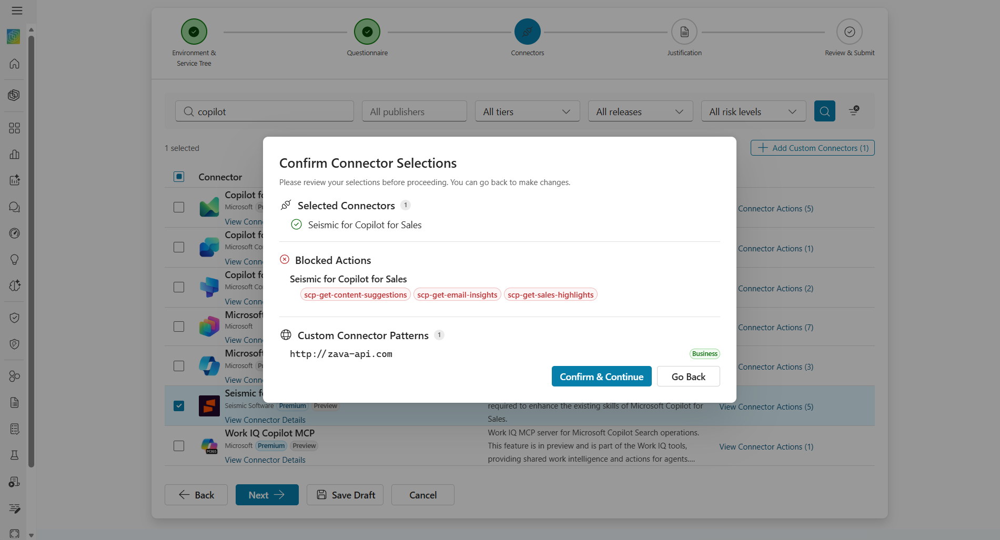

*Figure 12: Connector blocked by admin — dimmed row with "Blocked by Admin" badge, preventing selection*

**Connector Actions dialog:**

Click **View Connector Actions** on any connector to see and configure its individual actions.


*Figure 13: Connector Actions dialog showing action-level Allow/Block toggles with bulk Allow All and Block All controls*

- Each action has a toggle switch: **Allow** (green) or **Block** (red).
- Use **Allow All** or **Block All** buttons for bulk configuration.
- Click **Save** to commit your overrides, or **Cancel** to discard.

**Custom Connector Patterns:**

Click **Custom Connectors** in the toolbar to define URL patterns for custom connectors.


*Figure 14: Custom Connector Patterns dialog for defining URL patterns with data group classification*

- Add up to 5 custom connector URL patterns per request.
- Each pattern specifies a host URL pattern (with wildcard `*` support) and a data group (Non-business, Business, or Blocked).

#### Step 4: Business Justification

Provide a business justification for your connector access request.


*Figure 15: Wizard Step 4 — business justification text area and optional supporting document upload*

- **Justification** (required): Explain why you need these connectors. Minimum 20 characters.
- **Supporting Document** (optional): Attach a single file (PDF, DOCX, XLSX, PNG, or JPG, max 25 MB). You can preview the attached file using the eye icon before submission.

#### Step 5: Review & Submit

Review your complete request before submission.


*Figure 16: Wizard Step 5 — request summary showing Service Tree, environments, and connectors*

<br>

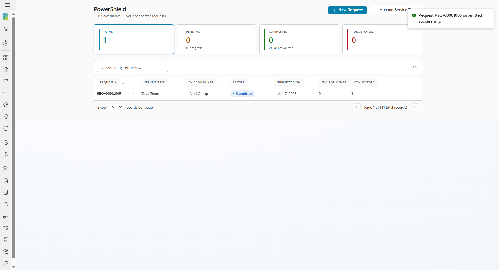

*Figure 17: Post-submission confirmation — maker home screen with success toast notification*

This step displays:
1. **Service Tree and Environment Container** capsule badges (clickable for details)
2. **Environments** — list of environments with links to view their DLP policies in the Admin Center
3. **Connectors** — selected connectors with expandable blocked actions details
4. **Custom Connector Patterns** (if any)
5. **Questionnaire Answers** (collapsible, if questionnaire was completed)
6. **Justification** text
7. **Supporting Document** (if attached)
8. **Co-owner(s)** — add co-owners who will receive read and write access to this request

**Adding Co-owners:**
- Paste a username (e.g., `user@domain.com`) and click **Add**.
- Co-owners can view request details, post comments, and collaborate on the request.
- You cannot add yourself or duplicate entries.
- Maximum 20 co-owners per request.

**Submitting:**
- Click **Submit Request** to open a confirmation dialog.
- Review the summary (Service Tree, environment count, connector count).
- Click **Submit** to finalize. Once submitted, you cannot edit the request.

---

### Save Draft and Resume

You can save your request as a draft at any wizard step and return to it later.

- Click **Save Draft** in the wizard navigation bar (available on every step after Step 1 requirements are met).
- The draft is saved to Dataverse and you are navigated to the request detail view.
- To resume: open the draft request and click **Resume Draft**, or click the draft row on the home screen.
- The wizard reopens at the step where you left off, with all previously entered data restored.

> **Note**: Drafts do not enforce the full validation rules — you can save without completing required fields like justification or questionnaire answers.

---

### Withdraw a request

You can withdraw your own request if it is in Draft or Submitted status.

1. Open the request detail view or use the row action menu (⋮) on the home screen.
2. Click **Withdraw**.
3. Confirm the withdrawal in the dialog: *"Are you sure you want to withdraw request REQ-XXXXX? This cannot be undone."*
4. The request moves to **Withdrawn** status and becomes read-only.

> **Note**: Withdrawing a request does not block you from creating a new request for the same Service Tree.

---

### Revise and resubmit

If you have withdrawn a request, you can revise and resubmit it.

1. Open the withdrawn request detail view.
2. Click **Revise & Resubmit**.
3. Confirm in the dialog that a new request will be created with the withdrawn request's data copied across.
4. The wizard opens at Step 1 with all data pre-populated (except the supporting document, which must be re-attached).
5. Make any needed changes and submit the new request.

The original withdrawn request remains unchanged for audit purposes.

---

### Clone a request

You can clone any existing request to create a new draft with the same configuration.

1. On the home screen, click the row action menu (⋮) on any request row.
2. Select **Clone**.
3. Confirm in the dialog: *"A copy of REQ-XXXXXXX will be created with the same service tree, environment group, and connector configuration."*
4. A new Draft request is created and you are navigated to its detail view.

**What is copied:** Service Tree, Environment Container, environments, connectors (with action overrides), custom connector patterns, questionnaire answers, and justification.

**What is NOT copied:** Co-owners (participants) and supporting documents.

---

### Request detail view (Maker)

Click any request row on the home screen to view its full details.

The detail view has a tabbed layout:
- **Summary** tab: Full request details including Service Tree, environments, connectors, questionnaire answers, justification, supporting document, co-owners, and admin comment (if any).
- **Comments** tab (non-Draft requests only): Discussion thread for communicating with admins.

**Available actions by status:**

| Status | Available Actions |
|--------|-------------------|
| Draft | Resume Draft, Withdraw |
| Submitted | Withdraw |
| Withdrawn | Revise & Resubmit |
| All other statuses | Read-only |

---

### Comments and discussion

After a request is submitted, you can exchange messages with admins via the Comments tab. This provides a structured communication channel for clarification requests, additional evidence, and decision context.

- Comments are displayed in a vertical timeline layout (oldest first).
- Admin comments have a blue accent; maker comments have a neutral style.
- **Posting a comment**: Type your message in the compose box at the bottom and click **Send**.
- **Attaching files**: Click **Attach files** to add one or more files (PDF, DOCX, XLSX, PNG, JPG, max 25 MB each).
- **Previewing attachments**: Click the eye icon on any attachment to preview it in-app. Click the download icon to download.
- Comments are **immutable** — they cannot be edited or deleted after posting, ensuring a reliable audit trail.

---

## Admin workflow

### Home screen (Admin view)

The Admin home screen provides a tenant-wide view of all policy requests with management controls.


*Figure 18: Admin home screen showing 6 stat cards, all-tenant request grid, and admin action buttons*

#### Stat cards

Six stat cards summarize the tenant-wide request portfolio:

| Card | Description |
|------|-------------|
| **All** | Total requests across the tenant |
| **Pending** | Requests currently under review |
| **Completed** | Approved and implemented requests, with approval rate |
| **Policy Failed** | Requests where DLP policy implementation encountered errors |
| **Rejected** | Rejected requests |
| **Withdrawn** | Withdrawn requests |

#### Admin-specific controls

The admin header includes:
- **Configure Questions** button — navigate to the Question Configuration screen
- **Blocked Connectors** button — navigate to the Blocked Connectors management screen
- **Settings** (⚙) icon button — navigate to Notification Settings

#### Admin grid

The admin grid includes all columns from the maker grid plus a **Created By** column showing the request submitter.

#### Notification settings banner

If required notification settings are not configured, a warning banner appears between the stat cards and the grid:

> **Notification settings incomplete.** Email notifications are disabled because the following settings are not configured: {missing list}. **Configure now →**

---

### Reviewing a request (Admin)

Open any request from the home screen to access the admin review interface.

The admin detail view has four tabs:
- **Summary** tab: Full request details (same as maker view).
- **Fulfillment** tab: DLP policy details and per-environment fulfillment status (admin-only).
- **Comments** tab: Discussion thread where admins can communicate with the maker.
- **Activity** tab: Fulfillment audit log showing DLP policy creation steps and results (admin-only).


*Figure 19: Fulfillment tab showing DLP policy details and per-environment fulfillment status*

#### Assign to Me

When a request is in **Submitted** status, click **Assign to Me** to move it to **Under Review**. This signals to other admins that you are actively reviewing the request.


*Figure 20: Assign to Me confirmation dialog*

#### Approve a request

When a request is in **Submitted** or **Under Review** status:

1. Click **Approve**.
2. A pre-flight dialog shows the impact on existing DLP policies:
   - If no existing policies are affected, a success message is displayed.
   - If existing policies will be modified, a warning lists the affected policies and environments to be reassigned.
   - If approving would leave an existing policy with zero environments, approval is **blocked** until the admin resolves the conflict in the Power Platform Admin Center.
3. Add an optional approval comment.
4. Acknowledge any policy impact (if applicable).
5. Click **Confirm Approve**.


*Figure 21: Review & Approve dialog showing pre-flight check results and approval confirmation*

After approval, PowerShield automatically:
1. Sets the request status to **Implementing**.
2. Resolves conflicts with existing DLP policies.
3. Creates a new scoped DLP policy with the requested connectors and environments.
4. Updates the request status to **Implemented** (or **Policy Failed** if errors occur).

#### Reject a request

When a request is in **Submitted** or **Under Review** status:

1. Click **Reject**.
2. Add a **required** comment explaining the rejection reason.
3. Click **Confirm Reject**.
4. The request moves to **Rejected** status. The maker is notified and can view the rejection comment.

---

### Blocked Connectors management

Navigate to **Blocked Connectors** from the admin home screen to manage the tenant-level blocked connectors list.

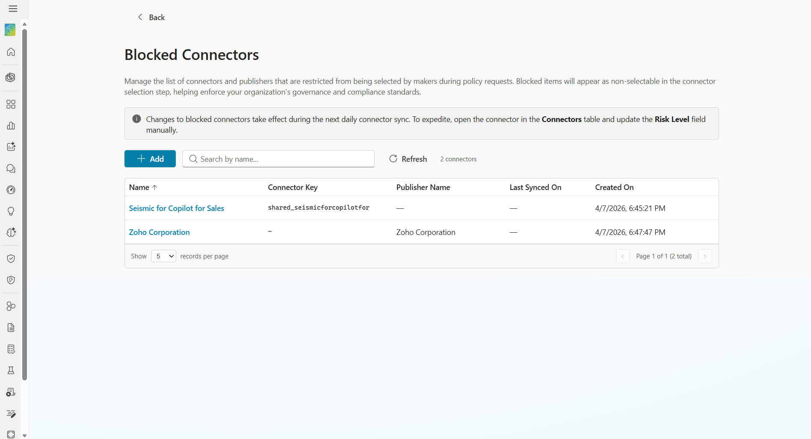

*Figure 22: Blocked Connectors management screen showing the list of blocked connectors with search and add controls*

Blocked connectors cannot be requested by makers in the wizard. They appear dimmed with a "Blocked by Admin" badge.

#### Grid columns

| Column | Description |
|--------|-------------|
| Name | Display name of the blocked connector or publisher |
| Connector Key | Internal connector identifier (blank for publisher-blocked entries) |
| Publisher Name | Publisher name (blank for connector-key-blocked entries) |
| Block Reason | Admin-provided reason for blocking |
| Is Non-Blockable | Whether the block can be overridden (reserved for future use) |
| Last Synced On | Timestamp of last sync that processed this record |
| Created On | Record creation timestamp |

#### Adding a blocked connector

1. Click **+ Add** in the toolbar.
2. Select a **Block Type**: Connector (block a specific connector) or Publisher (block all connectors from a publisher).
3. Type at least 3 characters and click **Search** to find the connector or publisher.
4. Select from the search results. Already-blocked items appear disabled with an "Already blocked" badge.
5. Enter a **Block Reason** (required).
6. Click **Save**.

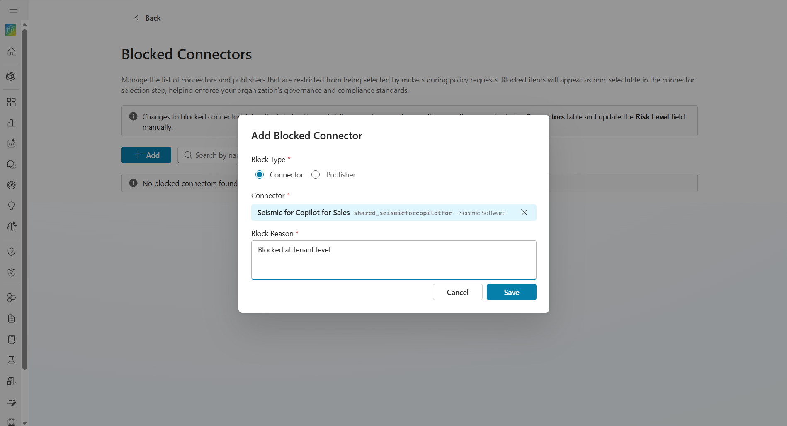

*Figure 23: Add blocked connector dialog — Connector type with search results and block reason*

<br>

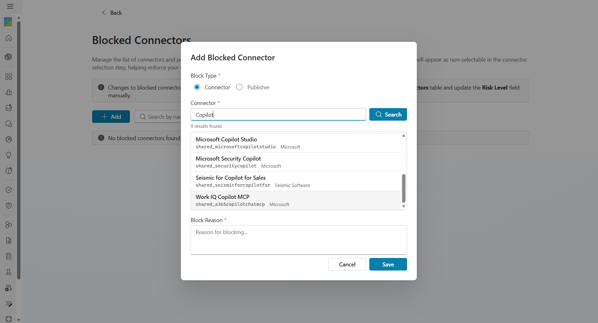

*Figure 24: Add blocked connector dialog — Publisher type showing publisher search results*

> **Note**: Changes to blocked connectors take effect during the next daily connector sync. To expedite, open the connector in the "Connectors" table and update the "Risk Level" field manually.

---

### Question Configuration

Navigate to **Configure Questions** from the admin home screen to manage the compliance questionnaire.

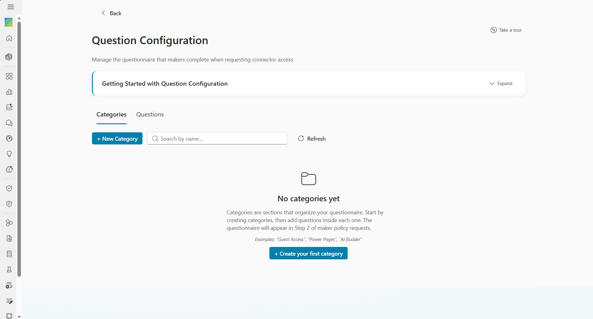

*Figure 25: Question Configuration screen — empty state on first visit*

The questionnaire configured here appears in **Wizard Step 2** when makers submit connector access requests. Maker responses serve as decision points during the approval process.

> **Note**: The Copilot Studio Kit ships without any question data. When you first open Question Configuration, all grids will be empty. A guided tour and Getting Started Guide help you create your first questionnaire.

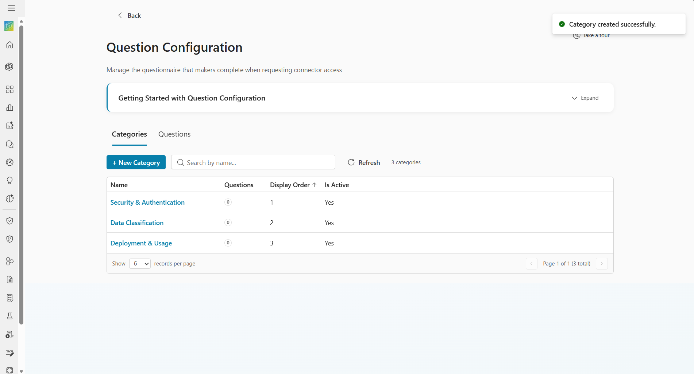

*Figure 26: Question Configuration screen with populated categories showing question counts*

#### Hierarchical drill-down

The screen uses a 3-level drill-down:

1. **Categories List** → click a category name to drill into its detail
2. **Category Detail** → edit the category and manage its questions
3. **Question Detail** → edit the question and manage its answer options

Breadcrumb navigation (e.g., `Categories › Guest Access › Will guests need access...`) lets you navigate back to any level.

#### Managing categories

Categories are section headers that group questions in the maker's wizard form.

- Click **+ New Category** to create a category with a name, display order, and active status.

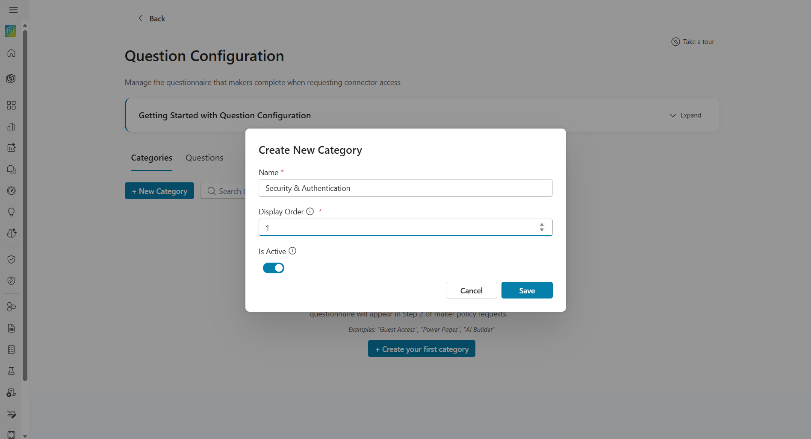

*Figure 27: Create New Category dialog with name, display order, and active status*

- Click a category name to edit its details inline.
- Delete a category only if it has no questions (otherwise, delete questions first).

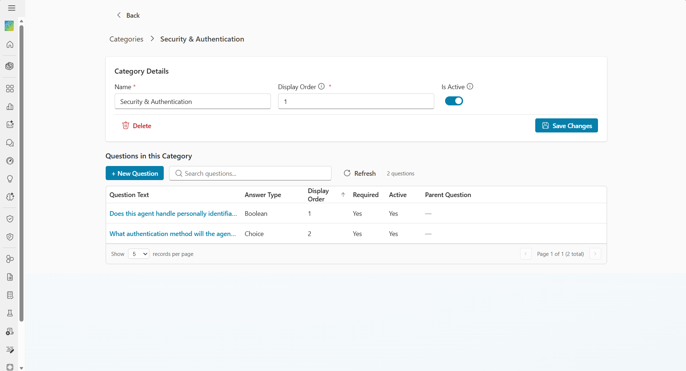

*Figure 28: Category Detail view showing inline editable form and questions subgrid*

<br>

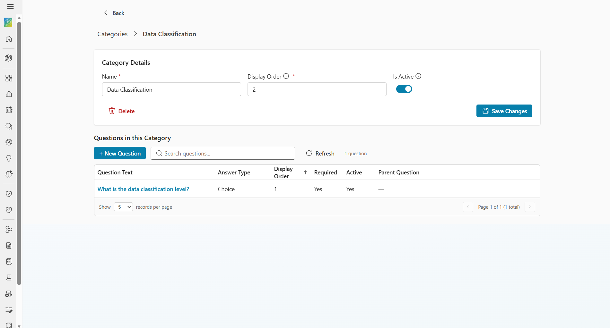

*Figure 29: Example — "Data Classification" category detail with questions subgrid*

#### Managing questions

Questions are the individual prompts shown to makers.

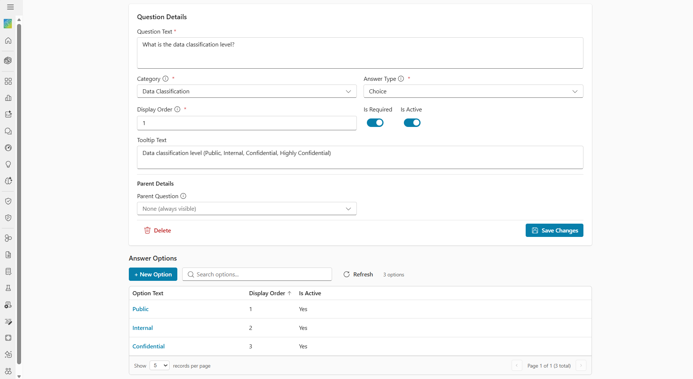

*Figure 30: Question Detail view showing inline editable form, configuration fields, and answer options subgrid*

- Click **+ New Question** to create a question within a category.

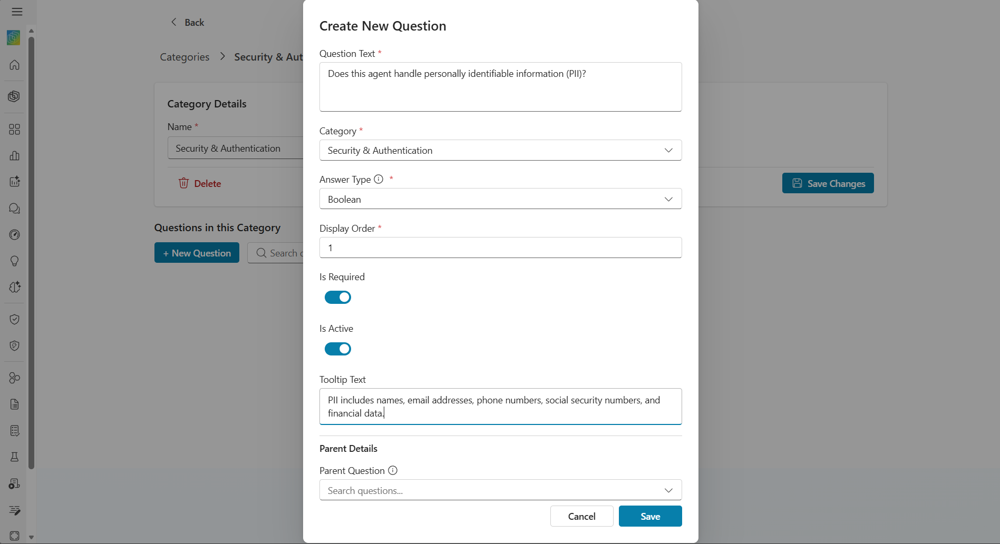

*Figure 31: Create New Question dialog with answer type, display order, required toggle, and tooltip fields*

- Configure the **Answer Type**: Boolean (Yes/No), Text, Choice (single-select), MultiselectChoice (multi-select), or Date.
- Set **Display Order** to control the position within its category.
- Mark as **Required** to make the answer mandatory for makers.
- Set a **Tooltip** for contextual help shown via an info icon.
- Configure **Conditional Logic**: Set a Parent Question and Trigger Value to make this question conditional — it only appears when the parent has a specific answer.

#### Managing answer options

For Choice and MultiselectChoice questions, define the available answer options.

- Click **+ New Option** to add an option with text, display order, and active status.

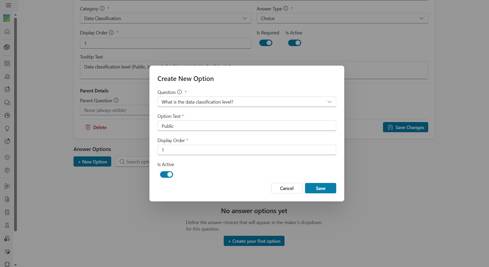

*Figure 32: Create New Option dialog with option text, display order, and active status fields*

- Options appear as dropdown items (Choice) or checkbox items (MultiselectChoice) in the maker's wizard.

#### Guided tour

On your first visit, a 3-step guided tour introduces the Question Configuration interface. You can re-trigger it at any time by clicking **Take a tour** in the page header.

---

### Notification Settings

Navigate to **Notification Settings** via the gear (⚙) icon on the admin home screen.


*Figure 33: Notification Settings screen with email configuration fields*

Configure the following settings to enable email notifications:

| Setting | Description | Required |
|---------|-------------|----------|
| **Sender Email Address** | The email address used to send notification emails | Yes |
| **Admin Distribution List** | Email distribution list for admin notifications | No |
| **PowerShield App URL** | Direct URL to the PowerShield app (used in email links) | No |
| **Notifications Enabled** | Master toggle to enable/disable all notifications | — |

> **Important**: Without the Sender Email Address configured, all email notifications will silently fail. The admin home screen displays a warning banner if required settings are missing.

---

## Request status lifecycle

Each policy request follows a defined lifecycle with clear status transitions.

```
[New Wizard] ──── Save Draft ───→ Draft ←── Resume Draft
                                    │
                   Maker Withdraw ──┼──→ Withdrawn ──→ Revise & Resubmit (new request)
                                    │
                   Wizard Submit ───┼──→ Submitted
                                    │         │
                   Auto-Reject ─────┼──→ AutoRejected
                                    │
                   Admin Approve ───┼──→ Approved ──→ Implementing ──→ Implemented
                   Admin Reject ────┼──→ Rejected                    ↘ ImplementedWithErrors
                   Assign to Me ────┼──→ UnderReview
                                    │         │
                                    │   Admin Approve ──→ Approved
                                    │   Admin Reject  ──→ Rejected
```

### Status reference

| Status | Display Label | Description | Set By |
|--------|---------------|-------------|--------|
| Draft | Draft | Request saved but not yet submitted | Maker (Save Draft) |
| Submitted | Submitted | Request submitted for admin review | Maker (Wizard Submit) |
| UnderReview | In Review | Admin has taken ownership and is reviewing | Admin (Assign to Me) |
| Approved | Approved | Admin approved; DLP policy creation initiated | Admin (Approve) |
| Implementing | In Progress | DLP policy is being created | System (automatic) |
| Implemented | Completed | DLP policy successfully created | System (automatic) |
| ImplementedWithErrors | Policy Failed | DLP policy creation encountered errors | System (automatic) |
| Rejected | Rejected | Admin rejected the request | Admin (Reject) |
| AutoRejected | Auto Rejected | Automatically rejected by external flow | System (external flow) |
| Withdrawn | Withdrawn | Maker withdrew the request | Maker (Withdraw) |

### In-progress constraint

Only one active request can exist per Service Tree at a time. A new request is blocked if any existing request for the same Service Tree has status: Draft, Submitted, UnderReview, Approved, Implementing, or AutoRejected.

Terminal statuses (Withdrawn, Rejected, Implemented, ImplementedWithErrors) do **not** block new requests.

---

## Reference: Key Dataverse tables

PowerShield uses the following key Dataverse tables. All tables use the `cat_` publisher prefix.

### Master tables

| Table | Purpose |
|-------|---------|
| `cat_servicetree` | Maker-defined organizational groupings for scoping requests |
| `cat_connector` | Connector catalog (maintained by sync flow) |
| `cat_connectoraction` | Individual actions per connector (maintained by sync flow) |
| `cat_powershieldblockedconnectors` | Admin-maintained blocked connectors list |
| `cat_questioncategory` | Admin-configurable questionnaire section headers |
| `cat_question` | Admin-configurable compliance questions |
| `cat_questionoption` | Answer options for Choice/MultiselectChoice questions |

### Transaction tables

| Table | Purpose |
|-------|---------|
| `cat_policyrequest` | Main request header with status, justification, and admin comment |
| `cat_policyrequestenvironment` | Selected environments per request with fulfillment tracking |
| `cat_policyrequestconnector` | Selected connectors per request with action overrides |
| `cat_policyrequestanswer` | Questionnaire answers with immutable question text snapshot |
| `cat_policyrequestparticipant` | Co-owners (participants) associated with a request |
| `cat_powershieldcustomconnectorpattern` | Custom connector URL patterns per request |
| `cat_powershieldpolicyrequestcomment` | Discussion thread comments on requests |
| `cat_powershieldpolicyrequestlog` | Append-only fulfillment audit log (admin-visible only) |

### Supporting tables

| Table | Purpose |
|-------|---------|
| `cat_powershieldenvironmentgroups` | Named environment containers scoped to a Service Tree |
| `cat_powershieldenvironmentgroupmembers` | Individual environments within a container |
| `cat_powershieldservicetreemembers` | Service Tree membership (users linked to trees) |
| `cat_powershieldsettings` | Key-value settings for notification configuration |

---

## FAQs and troubleshooting

### General questions

**Q: What happens after my request is approved?**

A: PowerShield automatically creates a scoped DLP policy in the Power Platform Admin Center. The request status progresses from Approved → Implementing → Implemented (or Policy Failed if errors occur). You can track the progress on the request detail view.

**Q: Can I edit a submitted request?**

A: No. Once a request is submitted, it cannot be edited. If you need to make changes, you can withdraw the request and create a new one using **Revise & Resubmit**, or clone it.

**Q: What does "Policy Failed" mean?**

A: This status indicates that the DLP policy creation or modification encountered an error. The admin can view the error details in the **Activity** tab of the request detail. Common causes include permission issues, environment conflicts, or Power Platform API errors.

**Q: How do I know which connectors are blocked?**

A: Blocked connectors appear dimmed in the connector selection grid (Step 3) with a "Blocked by Admin" badge. They cannot be selected. Contact your PowerShield Admin for more information on why a connector is blocked.

**Q: Can I request access for a Developer environment?**

A: No. Developer environments are automatically excluded from the environment list. Only Production, Sandbox, Trial, Default, and Teams environments are available.

**Q: What is the difference between the admin comment and the Comments thread?**

A: The **admin comment** is the formal decision record attached to an approval or rejection. It appears on the Summary tab. The **Comments thread** is a separate, ongoing discussion facility on the Comments tab for back-and-forth communication between maker and admin during the review process.

**Q: Why can't I see any Service Trees?**

A: You must be a member of a Service Tree to see it. Ask the Service Tree creator to add you as a member, or create a new Service Tree.

**Q: What is the System Administrator role validation?**

A: When you click Next on Step 1, PowerShield verifies that you have the System Administrator security role in each environment within your selected container. This is required because DLP policy changes require admin-level permissions. If you lack the role in any environment, you must either get the role assigned or select a different container.

### Admin questions

**Q: How do I configure the compliance questionnaire?**

A: Navigate to **Configure Questions** from the admin home screen. Create categories (section headers), then add questions within each category. Configure answer types, conditional logic, and answer options. The questionnaire automatically appears in Step 2 of the maker's request wizard.

**Q: What happens if I approve a request that conflicts with existing DLP policies?**

A: The pre-flight dialog shows you which existing policies will be affected and which environments will be reassigned. If approving would leave an existing policy with zero environments, approval is blocked until you resolve the conflict in the Power Platform Admin Center. PowerShield handles conflict resolution automatically for non-blocking scenarios.

**Q: How do I block a connector tenant-wide?**

A: Navigate to **Blocked Connectors** from the admin home screen. Click **+ Add** and search for the connector or publisher you want to block. Provide a reason and save. The block takes effect during the next connector sync cycle.

**Q: Why are email notifications not being sent?**

A: Check the **Notification Settings** (gear icon on the home screen). Ensure the **Sender Email Address** is configured and **Notifications Enabled** is checked. The admin home screen shows a warning banner if required settings are missing.

### Troubleshooting

**Issue: "No environments available" in the wizard**

- Ensure you have access to at least one Power Platform environment (non-Developer).
- Verify the PowerShield APIFlow connection is active and properly configured.
- Check that the connection user has the required permissions.

**Issue: "In-progress conflict" error when creating a request**

- Another active request (Draft, Submitted, Under Review, Approved, or Implementing) already exists for the same Service Tree.
- Wait for the existing request to reach a terminal status (Implemented, Rejected, Withdrawn), or withdraw it first.

**Issue: Request stuck in "Implementing" status**

- Check the **Activity** tab (admin only) for error details.
- Verify the PowerShield BAPAPI connection is active.
- Ensure the approving admin has Power Platform Admin permissions.
- If the fulfillment failed, the status may transition to **Policy Failed** — review the error details and retry.

**Issue: Cannot see the "Configure Questions" or "Blocked Connectors" buttons**

- These features are only available to users with the **PowerShield Admin** security role. Contact your Dataverse administrator to verify your role assignment.

**Issue: Connector icons not loading**

- Connector icons are loaded from external URLs. The Power Apps Content Security Policy may block some external image sources. A fallback plug icon is displayed when the original icon cannot load. This does not affect functionality.
